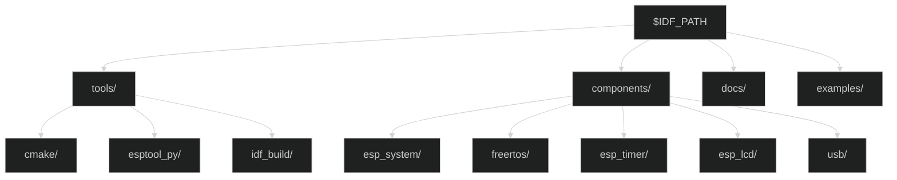
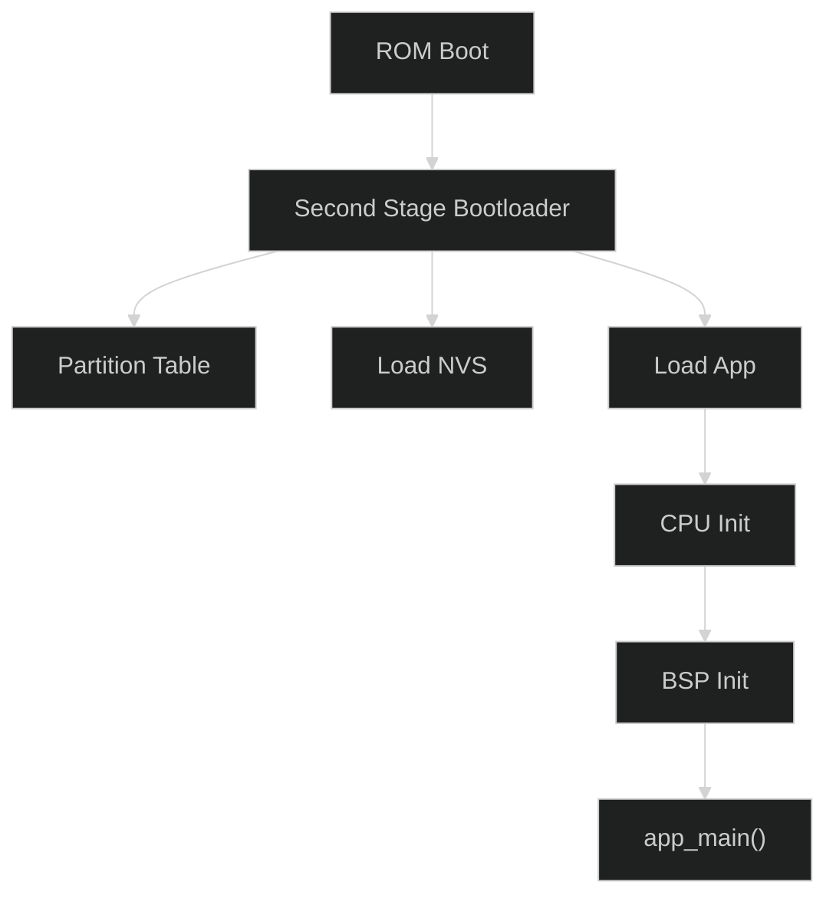

# ESP-IDF开发专题

## 一、ESP-IDF环境配置

### 1.1 ESP-IDF版本

| 项目 | 值 |
|:--|:--|
| ESP-IDF版本 | 5.4.0 |
| 目标芯片 | ESP32-P4 |
| 工具链 | RISC-V GCC |
| Python版本 | 3.8+ |
| CMake版本 | 3.16+ |

### 1.2 环境变量

```bash
# 设置IDF环境 (Linux/macOS)
. ./export.sh

# Windows (PowerShell)
.\export.ps1

# 验证环境
idf.py --version
# 应该输出: ESP-IDF v5.4.0
```

### 1.3 IDF_PATH结构



---

## 二、项目构建配置

### 2.1 CMakeLists.txt配置

```cmake
# 顶层CMakeLists.txt
cmake_minimum_required(VERSION 3.16)

include($ENV{IDF_PATH}/tools/cmake/project.cmake)
add_compile_options(-Wno-ignored-qualifiers)
project(usb_touch_screen)
```

### 2.2 main/CMakeLists.txt

```cmake
idf_component_register(
    SRCS_DIRS "." "usb_device" "uac"
    INCLUDE_DIRS "." "include" "uac" "usb_device"
)

# TinyUSB组件链接
idf_component_get_property(tusb_lib leeebo__tinyusb_src COMPONENT_LIB)
target_link_libraries(${tusb_lib} PRIVATE ${COMPONENT_LIB})
```

---

## 三、sdkconfig关键配置

### 3.1 芯片配置

| 配置项 | 值 | 说明 |
|:--|:--|:--|
| `CONFIG_IDF_TARGET` | esp32p4 | 目标芯片 |
| `CONFIG_IDF_FIRMWARE_CHIP_ID` | 0x0012 | 固件芯片ID |
| `CONFIG_SOC_CPU_CORES_NUM` | 2 | CPU核心数 |
| `CONFIG_SOC_CPU_HAS_FPU` | y | FPU支持 |

### 3.2 内存配置

| 配置项 | 值 | 说明 |
|:--|:--|:--|
| `CONFIG_ESPTOOLPY_FLASHSIZE` | 16MB | Flash大小 |
| `CONFIG_ESPTOOLPY_FLASHFREQ` | 80m | Flash频率 |
| `CONFIG_SPIRAM_MODE` | hex | PSRAM模式 |
| `CONFIG_SPIRAM_SPEED` | 200M | PSRAM频率 |
| `CONFIG_SPIRAM_SIZE` | 0x2000000 | PSRAM大小 |

### 3.3 CPU频率配置

| 配置项 | 值 | 说明 |
|:--|:--|:--|
| `CONFIG_ESP_DEFAULT_CPU_FREQ_MHZ_360` | y | 360MHz (性能模式) |
| `CONFIG_ESP_MINIMAL_MEM_LEVEL` | 2 | 最小内存级别 |
| `CONFIG_COMPILER_OPTIMIZATION_PERF` | y | 性能优化 |

---

## 四、组件配置

### 4.1 TinyUSB配置

| 配置项 | 值 | 说明 |
|:--|:--|:--|
| `CONFIG_TINYUSB` | y | 启用TinyUSB |
| `CONFIG_TINYUSB_RHPORT_HS` | y | High-Speed模式 |
| `CONFIG_TUSB_VID` | 0x303A | 厂商ID |
| `CONFIG_TUSB_PID` | 0x2986 | 产品ID |
| `CONFIG_USB_TASK_PRIORITY` | 5 | USB任务优先级 |

### 4.2 FreeRTOS配置

| 配置项 | 值 | 说明 |
|:--|:--|:--|
| `CONFIG_FREERTOS_HZ` | 1000 | 系统节拍 |
| `CONFIG_FREERTOS_NUMBER_OF_CORES` | 2 | 核心数 |
| `CONFIG_FREERTOS_UNICORE` | n | 双核模式 |
| `CONFIG_FREERTOS_TASK_NOTIFICATION_ARRAY_ENTRIES` | 1 | 任务通知数组 |
| `CONFIG_FREERTOS_MAX_TASK_NAME_LEN` | 16 | 任务名长度 |

### 4.3 日志配置

| 配置项 | 值 | 说明 |
|:--|:--|:--|
| `CONFIG_LOG_DEFAULT_LEVEL` | INFO | 默认日志级别 |
| `CONFIG_LOG_MAXIMUM_LEVEL` | INFO | 最大日志级别 |
| `CONFIG_LOG_TIMESTAMP_SOURCE_RTOS` | y | 时间戳源 |

---

## 五、构建与烧录

### 5.1 构建命令

```bash
# 1. 设置目标芯片 (首次)
idf.py set-target esp32p4

# 2. 构建项目
idf.py build

# 3. 烧录固件
idf.py -p /dev/ttyUSB0 flash

# 4. 烧录并监控
idf.py -p /dev/ttyUSB0 flash monitor

# 5. 清理构建
idf.py clean

# 6. 完全重建
idf.py fullclean && idf.py build
```

### 5.2 分区表

```
# partitions_singleapp.csv
# Name,   Type, SubType, Offset,  Size, Flags
nvs,      data, nvs,     0x9000,  0x6000,
phy_init, data, phy,     0xf000,  0x1000,
factory,  app,  factory, 0x10000, 0x3F0000,
```

### 5.3 启动流程



---

## 六、调试技术

### 6.1 串口监视器

```bash
# 基本监控
idf.py monitor

# 指定波特率
idf.py monitor -b 921600

# 过滤日志
idf.py monitor | grep -E "ERROR|WARN|USB"

# 同时烧录和监控
idf.py -p /dev/ttyUSB0 -b 921600 flash monitor
```

### 6.2 OpenOCD调试

```bash
# 启动OpenOCD
openocd -f board/esp32p4.cfg

# 在另一个终端
idf.py openocd

# GDB连接
xtensa-esp32p4-elf-gdb build/project.elf
```

### 6.3 常见错误排查

| 错误 | 原因 | 解决方案 |
|:--|:--|:--|
| `Failed to connect` | 串口占用 | 关闭其他串口软件 |
| `A fatal error occurred` | Flash损坏 | 擦除Flash后重试 |
| ` Brownout detector` | 电源不稳定 | 检查USB供电 |
| `Guru Meditation` | 内存错误 | 检查指针/DMA配置 |

---

## 七、性能优化

### 7.1 CPU优化

| 优化项 | 方法 | 效果 |
|:--|:--|:--|
| 频率 | 360MHz | 高性能 |
| 缓存 | 使能ICache | 加速指令 |
| 编译优化 | -O2/-Ofast | 代码优化 |
| 内联 | __attribute__((always_inline)) | 减少调用 |

### 7.2 内存优化

| 优化项 | 方法 | 效果 |
|:--|:--|:--|
| PSRAM | 帧缓冲 | 释放DRAM |
| DMA | 大数据传输 | 减少CPU负载 |
| 内存池 | 预分配 | 减少碎片 |
| 栈大小 | 合理配置 | 节省内存 |

### 7.3 DMA配置

```c
// DMA通道配置
dma_config_t dma_config = {
    .direction = DMA_DIR_MEM_TO_PERIPH,
    .src_num = 1,
    .dst_num = 1,
    .src_max_burst = 16,
    .dst_max_burst = 16,
};

// PSRAM DMA支持
ESP_ERROR_CHECK(dma_channel_allocate(DMA_UNIT_AXI, &dma_handle));
```

---

## 八、功耗管理

### 8.1 功耗模式

| 模式 | 功耗 | 进入条件 |
|:--|:--|:--|
| Active | 全速 | 默认 |
| Modem-Sleep | 降低 | CPU空闲 |
| Light-Sleep | 很低 | 所有外设空闲 |
| Deep-Sleep | 极低 | RTC唤醒 |

### 8.2 动态频率调整

```c
// 设置CPU频率
esp_pm_config_t pm_config = {
    .max_cpu_freq = ESP_PM_CPU_FREQ_360M,
    .min_cpu_freq = ESP_PM_CPU_FREQ_80M,
};
ESP_ERROR_CHECK(esp_pm_configure(&pm_config));
```

### 8.3 USB不断开配置

<span style="color:red;">⚠️ 注意：USB连接时不进入深度睡眠，避免断开连接。</span>

```c
// 禁止USB相关睡眠
esp_pm_lock_handle_t usb_lock;
esp_pm_lock_create(ESP_PM_APB_FREQ_MAX, 0, "usb", &usb_lock);
```

---

## 九、组件管理

### 9.1 idf_component.yml

```yaml
# idf_component.yml
version: "1.0.0"
description: ESP32-P4 USB Touch Screen
dependencies:
  espressif/esp_lcd_ek79007: "^1.0.0"
  espressif/esp_lcd_touch_ft5x06: "^1.0.0"
  espressif/lvgl: "^9.0.0"
```

### 9.2 组件搜索

```bash
# 搜索组件
idf.py search-component esp_lcd

# 安装组件
idf.py add-dependency esp_lcd_ek79007

# 更新组件
idf.py update-dependencies
```

---

## 十、代码规范

### 10.1 命名规范

| 类型 | 规范 | 示例 |
|:--|:--|:--|
| 变量 | 小写下划线 | `frame_buffer` |
| 常量 | 大写下划线 | `MAX_SIZE` |
| 函数 | 小写下划线 | `init_display()` |
| 结构体 | 小写下划线 | `usb_config_t` |
| 枚举 | 小写下划线 | `state_idle` |
| 文件 | 小写下划线 | `usb_device.c` |

### 10.2 代码注释

```c
/**
 * @brief 初始化USB显示设备
 *
 * @param config USB配置指针
 * @return ESP_OK 成功
 *         ESP_FAIL 失败
 */
esp_err_t usb_display_init(const usb_config_t *config);

// TODO: 优化JPEG压缩算法
// FIXME: 修复触控中断丢失问题
```

---

## 十一、版本信息

| 版本 | 日期 | 修改内容 |
|:--|:--|:--|
| v1.0 | 2026-04-02 | 初始版本 |

---

## 十二、参考资料

| 参考资料 | 链接 |
|:--|:--|
| ESP-IDF文档 | [docs.espressif.com](https://docs.espressif.com/projects/esp-idf/en/latest/) |
| ESP32-P4指南 | [docs.espressif.com](https://docs.espressif.com/projects/esp-dev-kits/en/latest/esp32p4/) |
| CMake手册 | [cmake.org](https://cmake.org/documentation/) |
