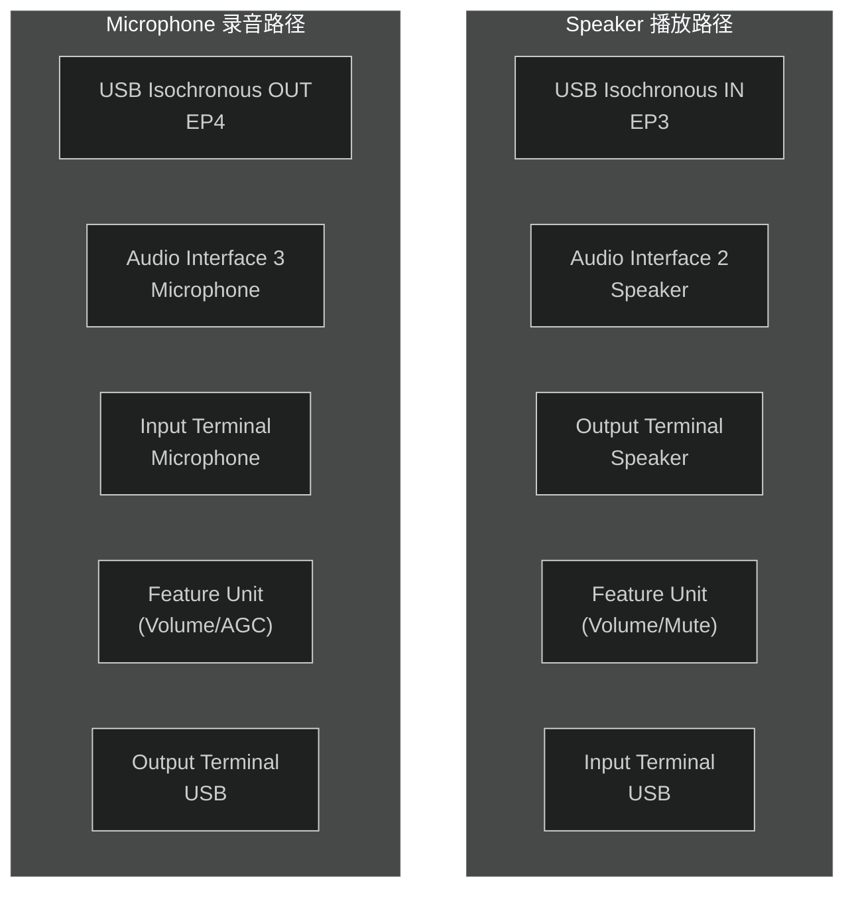
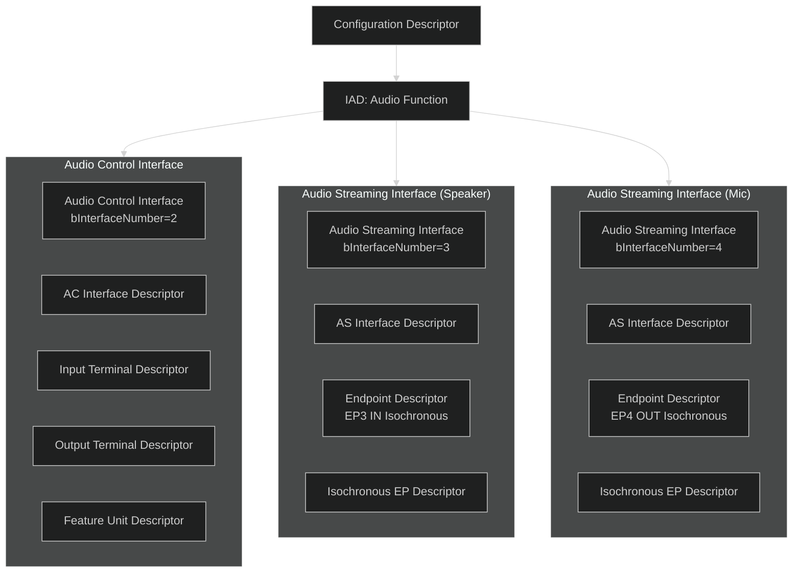
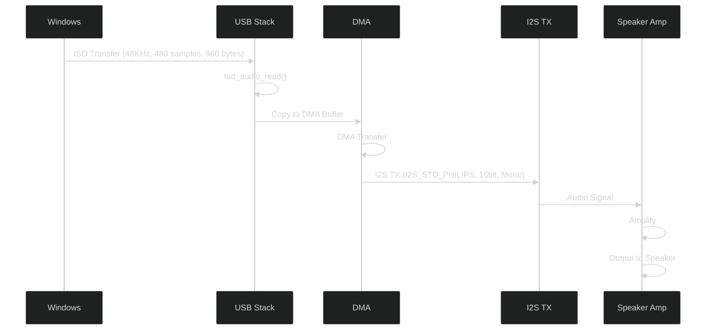
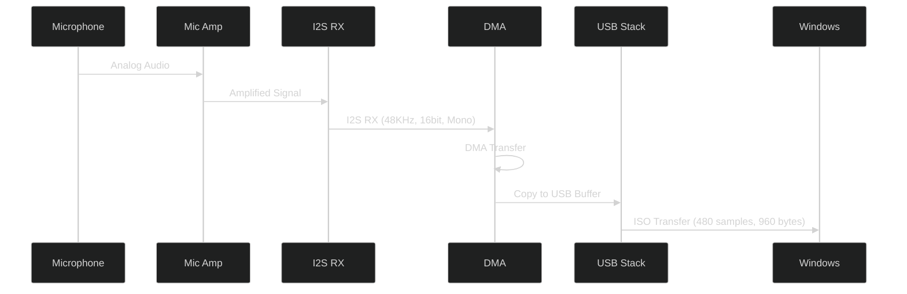
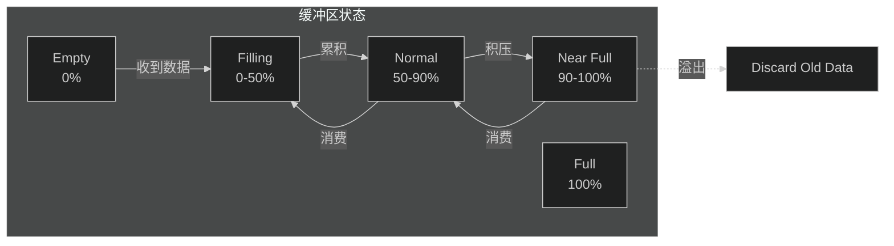

# UAC音频专题

## 一、UAC基础知识

### 1.1 USB Audio Class (UAC) 概述

USB Audio Class (UAC) 是 USB-IF 定义的标准音频设备类，用于通过 USB 传输音频数据。本项目实现了 UAC1.0（USB Audio Class 1.0），支持 Speaker（扬声器）和 Microphone（麦克风）功能。

### 1.2 UAC版本对比

| 版本 | 发布时间 | 主要特性 | 本项目 |
|:--|:--|:--|:--|
| UAC1.0 | 1998 | 基础音频传输 | ⚠️ 使用 |
| UAC2.0 | 2008 | 高带宽、多通道、时钟同步 | - |
| UAC3.0 | 2020 | 低功耗、音频路径优化 | - |

### 1.3 音频参数

| 参数 | 值 | 说明 |
|:--|:--|:--|
| 采样率 | 48000 Hz | 标准48kHz采样 |
| 位深度 | 16-bit | 每样本16位 |
| 通道数 | 1 (单声道) | Mono |
| 每帧样本数 | 480 | 10ms × 48000 / 1000 |
| 每帧字节数 | 960 | 480 × 1ch × 2B |
| 传输间隔 | 10ms | 同步传输周期 |

---

## 二、UAC设备架构

### 2.1 UAC接口拓扑



### 2.2 UAC描述符层次



---

## 三、UAC描述符详解

### 3.1 Audio Control Interface Descriptor

```c
// 音频控制接口描述符
typedef struct {
    uint8_t  bLength;            // 描述符长度 (9)
    uint8_t  bDescriptorType;    // 0x04 = Interface
    uint8_t  bInterfaceNumber;   // 接口号 (2)
    uint8_t  bAlternateSetting;  // 备用设置 (0)
    uint8_t  bNumEndpoints;      // 端点数量 (0)
    uint8_t  bInterfaceClass;    // 0x01 = Audio
    uint8_t  bInterfaceSubClass; // 0x01 = Audio Control
    uint8_t  bInterfaceProtocol; // 0x00 = UAC1.0
    uint8_t  iInterface;         // 字符串索引
} audio_ac_interface_desc_t;
```

### 3.2 Input Terminal Descriptor (Speaker)

```c
// 输入终端描述符 - 表示数据源
typedef struct {
    uint8_t  bLength;            // 12
    uint8_t  bDescriptorType;    // 0x24 = CS_INTERFACE
    uint8_t  bDescriptorSubtype; // 0x02 = INPUT_TERMINAL
    uint8_t  bTerminalID;        // 终端ID (1)
    uint16_t wTerminalType;      // 0x0101 = USB Streaming
    uint8_t  bAssocTerminal;     // 关联终端 (0)
    uint8_t  bNrChannels;        // 通道数 (1)
    uint16_t wChannelConfig;     // 通道配置 (MONO)
    uint8_t  iChannelNames;      // 通道名称
    uint8_t  iTerminal;          // 终端名称
} input_terminal_desc_t;
```

### 3.3 Output Terminal Descriptor (Speaker)

```c
// 输出终端描述符 - 表示数据输出
typedef struct {
    uint8_t  bLength;            // 9
    uint8_t  bDescriptorType;    // 0x24 = CS_INTERFACE
    uint8_t  bDescriptorSubtype; // 0x03 = OUTPUT_TERMINAL
    uint8_t  bTerminalID;        // 终端ID (2)
    uint16_t wTerminalType;      // 0x0301 = Speaker
    uint8_t  bAssocTerminal;     // 关联终端 (0)
    uint8_t  bSourceID;          // 数据源ID (3, Feature Unit)
    uint8_t  iTerminal;          // 终端名称
} output_terminal_desc_t;
```

### 3.4 Feature Unit Descriptor

```c
// 特性单元描述符 - 音量/静音控制
typedef struct {
    uint8_t  bLength;            // 变量长度
    uint8_t  bDescriptorType;    // 0x24 = CS_INTERFACE
    uint8_t  bDescriptorSubtype; // 0x06 = FEATURE_UNIT
    uint8_t  bUnitID;           // 单元ID (3)
    uint8_t  bSourceID;          // 数据源ID (1, IT)
    uint8_t  bControlSize;       // 控制字段大小 (1)
    uint8_t  bmaControls[2];     // 控制Bitmap [Master, Ch1]
    uint8_t  iFeature;           // 特性名称
} feature_unit_desc_t;
```

---

## 四、音频数据流

### 4.1 Speaker数据流



### 4.2 Microphone数据流



---

## 五、I2S配置

### 5.1 I2S参数配置

| 参数 | Speaker | Microphone | 说明 |
|:--|:--|:--|:--|
| 采样率 | 48000 Hz | 48000 Hz | 同步 |
| 通道模式 | Mono | Mono | 单声道 |
| 位宽 | 16-bit | 16-bit | PCM格式 |
| 数据格式 | I2S_STD | I2S_STD | Philips标准 |
| 时钟极性 | 默认 | 默认 | CPOL=0 |
| WS极性 | 低=左 | 低=左 | 左声道 |

### 5.2 I2S时钟配置

```c
// I2S时钟源配置
typedef struct {
    // MCLK配置 (可选)
    uint32_t mclk_freq;     // 通常 = 256*fs = 12.288MHz
    bool     mclk_div;      // MCLK分频使能

    // BCLK配置
    uint32_t bclk_freq;     // BCLK = channels * bits * fs
                             // = 1 * 16 * 48000 = 768kHz
    uint32_t bclk_div;      // BCLK分频系数

    // WS配置
    uint32_t ws_width;       // Word Select宽度 = bits = 16
} i2s_clock_config_t;
```

### 5.3 I2S引脚配置

| 功能 | GPIO | 说明 |
|:--|:--|:--|
| I2S0_BCK | GPIO44 | 位时钟 |
| I2S0_WS | GPIO45 | 字选择 |
| I2S0_DO | GPIO43 | 数据输出 (Speaker) |
| I2S0_DI | GPIO42 | 数据输入 (Mic) |

---

## 六、音频缓存管理

### 6.1 DMA缓冲区配置

```c
// DMA缓冲区配置
typedef struct {
    // Ring Buffer配置
    uint8_t*  ring_buf;       // 环形缓冲区指针
    size_t    ring_buf_len;   // 缓冲区长度 (字节)

    // DMA描述符
    dma_descriptor_t* desc;    // DMA描述符数组

    // 传输参数
    size_t    sample_size;     // 样本大小 (2 bytes)
    size_t    samples_per_int; // 中断样本数 (480)
} audio_buffer_config_t;
```

### 6.2 缓冲区大小计算

| 参数 | 值 | 计算 |
|:--|:--|:--|
| 每样本字节 | 2 B | 16-bit Mono |
| 每帧样本 | 480 | 10ms × 48kHz / 1000 |
| 每帧字节 | 960 B | 480 × 2 |
| 缓冲区倍数 | 4x | - |
| 推荐缓冲 | 3840 B | 960 × 4 |

### 6.3 缓冲区管理策略



---

## 七、TinyUSB UAC接口

### 7.1 UAC回调函数

```c
// UAC音频回调
bool tud_audio_tx_complete_pre_read(uint8_t rhport, uint16_t n_bytes);
void tud_audio_rx_done(uint8_t rhport, uint8_t* buf, uint16_t len);
bool tud_audio_buffer_and_schedule_transmit(uint8_t rhport, uint8_t* buf, uint16_t len);
```

### 7.2 UAC传输流程

```mermaid
%%{init: {'theme':'dark'}}%%
flowchart TD
    START["Start"] --> INIT["uac_device_init()"]
    INIT --> CONFIG_I2S["Configure I2S"]
    INIT --> INIT_DMA["Init DMA Buffer"]
    INIT --> REG_CB["Register Callbacks"]

    loop 主循环
        TUD_TASK["tud_task()"] --> TUD_AUDIO["tud_audio_task()"]
        TUD_AUDIO --> RX_DONE{"RX Done?"}
        RX_DONE -->|"Yes"| COPY_DMA["Copy to DMA Buffer"]
        RX_DONE -->|"No"| WAIT
        COPY_DMA --> DMA_START["Start DMA Transfer"]
        DMA_START --> DMA_CMPL["DMA Complete ISR"]
        DMA_CMPL --> TX_DONE{"TX Complete?"}
        TX_DONE -->|"Yes"| READY_TX["Ready to TX"]
        TX_DONE -->|"No"| WAIT
    end
```

---

## 八、配置参数

### 8.1 sdkconfig UAC配置

| 配置项 | 值 | 说明 |
|:--|:--|:--|
| `CONFIG_UAC_SPEAKER_CHANNEL_NUM` | 1 | 扬声器通道数 |
| `CONFIG_UAC_MIC_CHANNEL_NUM` | 1 | 麦克风通道数 |
| `CONFIG_UAC_SAMPLE_RATE` | 48000 | 采样率 (Hz) |
| `CONFIG_UAC_SPK_INTERVAL_MS` | 10 | 扬声器传输间隔 |
| `CONFIG_UAC_MIC_INTERVAL_MS` | 10 | 麦克风传输间隔 |
| `CONFIG_UAC_SPK_NEW_PLAY_INTERVAL` | 100 | 新播放间隔 |
| `CONFIG_UAC_TINYUSB_TASK_PRIORITY` | 5 | TinyUSB任务优先级 |

### 8.2 音频数据速率

| 参数 | 值 | 说明 |
|:--|:--|:--|
| 理论比特率 | 768 Kbps | 48000 × 16 × 1 |
| 理论字节率 | 96 KB/s | 768000 / 8 |
| USB带宽占用 | ~1 MB/s | 含协议开销 |
| 每秒USB事务 | 100 | 1000ms / 10ms |

---

## 九、常见问题与解决

### 9.1 音频问题排查表

| 问题 | 可能原因 | 解决方案 |
|:--|:--|:--|
| 无声音 | I2S配置错误 | 检查BCLK/WS/DOUT引脚 |
| 杂音/爆音 | 采样率不匹配 | 确认48kHz同步 |
| 延迟大 | 缓冲区过大 | 减小缓冲倍数 |
| 断续 | DMA中断优先级低 | 提高DMA优先级 |
| 噪声 | 地线干扰 | 检查硬件连接 |

### 9.2 I2S调试方法

```c
// I2S调试：检查时钟
ESP_LOGI(TAG, "I2S Clock: MCLK=%d, BCLK=%d, WS=%d",
         mclk_freq, bclk_freq, sample_rate);

// 检查DMA状态
ESP_LOGI(TAG, "DMA: available=%d, size=%d",
         available_bytes, total_size);
```

---

## 十、硬件连接

### 10.1 扬声器连接

| ESP32-P4 | 功放板 | 说明 |
|:--|:--|:--|
| GPIO43 (I2S0_DO) | DIN | I2S数据输入 |
| GPIO45 (I2S0_WS) | BCK | 字选择时钟 |
| GPIO44 (I2S0_BCK) | LRCK | 左右声道时钟 |
| 3.3V | VCC | 供电 |
| GND | GND | 地线 |

### 10.2 麦克风连接

| ESP32-P4 | 麦克风模块 | 说明 |
|:--|:--|:--|
| GPIO42 (I2S0_DI) | DOUT | I2S数据输出 |
| GPIO45 (I2S0_WS) | BCK | 位时钟 |
| GPIO44 (I2S0_BCK) | LRCK | 字选择 |
| 3.3V | VCC | 供电 |
| GND | GND | 地线 |

---

## 十一、版本信息

| 版本 | 日期 | 修改内容 |
|:--|:--|:--|
| v1.0 | 2026-04-02 | 初始版本 |

---

## 十二、参考资料

| 参考资料 | 链接 |
|:--|:--|
| USB Audio Class 1.0 | [USB-IF](https://www.usb.org/) |
| TinyUSB UAC | [docs.tinyusb.org](https://docs.tinyusb.org/) |
| ESP-IDF I2S | [docs.espressif.com](https://docs.espressif.com/projects/esp-idf/en/latest/) |
