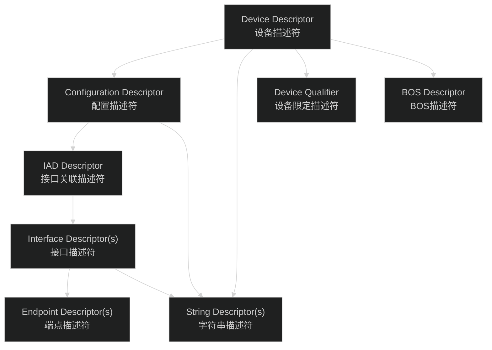
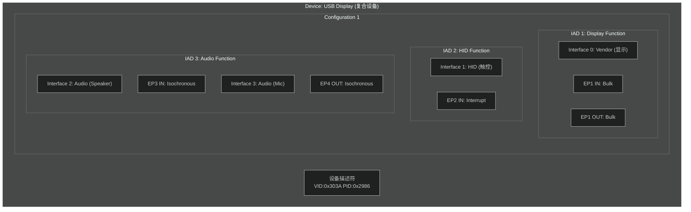
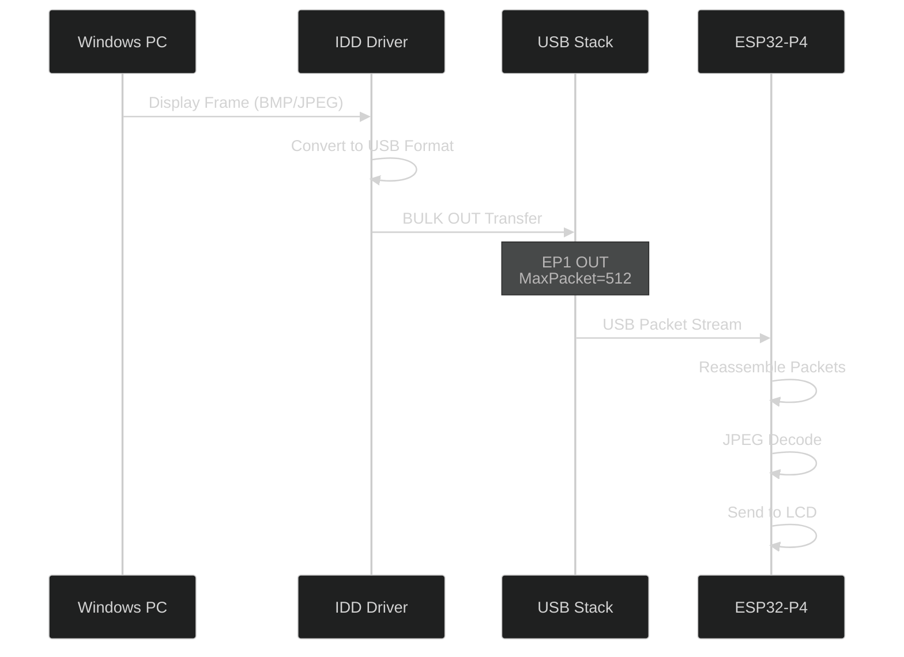
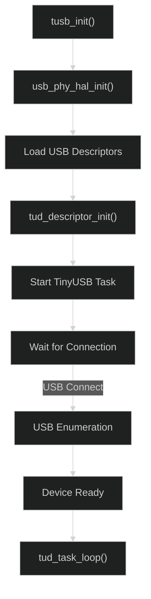

# USB协议专题

## 一、USB基础知识

### 1.1 USB版本与速率

| USB版本 | 速率 | 接口类型 | 本项目应用 |
|:--|:--|:--|:--|
| USB 1.0 | 1.5/12 Mbps | Full-Speed | - |
| USB 2.0 | 480 Mbps | High-Speed | ⚠️ USB OTG |
| USB 3.0 | 5 Gbps | SuperSpeed | - |
| USB 3.1 | 10 Gbps | SuperSpeed+ | - |

<span style="color:red;">本项目使用 USB 2.0 High-Speed 模式，实际可用带宽约 60 MB/s。</span>

### 1.2 USB传输类型

| 传输类型 | 特性 | 端点类型 | 本项目应用 |
|:--|:--|:--|:--|
| **Control** | 可靠、带握手、命令控制 | Control | USB枚举、配置 |
| **Bulk** | 可靠、无实时性、大数据 | Bulk IN/OUT | 显示数据 |
| **Interrupt** | 可靠、小数据、低延迟 | Interrupt IN | 触控数据 |
| **Isochronous** | 不可靠、实时性、流式 | Isochronous | 音频数据 |

### 1.3 USB OTG角色

```mermaid
%%{init: {'theme':'dark'}}%%
graph LR
    subgraph 本项目
        P4["ESP32-P4"] -->|"USB OTG<br/>(Device Mode)"| PC["Windows PC"]
    end

    style P4 fill:#1a1a3a,stroke:#2196F3
    style PC fill:#1a3a1a,stroke:#4CAF50
```



ESP32-P4 USB OTG 支持：
- **Device Mode**：模拟USB设备（当前使用）
- **Host Mode**：连接USB设备
- **OTG Mode**：自动协商角色

---

## 二、USB描述符体系

### 2.1 描述符类型



### 2.2 描述符结构（代码定义）

```c
// usb_descriptor.c 中的描述符结构

// 设备描述符
typedef struct __attribute__((packed)) {
    uint8_t  bLength;            // 描述符长度 (18)
    uint8_t  bDescriptorType;    // 0x01 = Device
    uint16_t bcdUSB;             // USB版本 (0x0200 = USB 2.0)
    uint8_t  bDeviceClass;       // 设备类 (0xEF = IAD)
    uint8_t  bDeviceSubClass;    // 子类
    uint8_t  bDeviceProtocol;    // 协议
    uint8_t  bMaxPacketSize0;   // 端点0最大包大小 (64)
    uint16_t idVendor;           // VID (0x303A)
    uint16_t idProduct;          // PID (0x2986)
    uint16_t bcdDevice;          // 设备版本
    uint8_t  iManufacturer;      // 厂商字符串索引
    uint8_t  iProduct;           // 产品字符串索引
    uint8_t  iSerialNumber;      // 序列号字符串索引
    uint8_t  bNumConfigurations; // 配置数量
} tusb_desc_device_t;
```

### 2.3 本项目描述符配置

| 描述符字段 | 值 | 说明 |
|:--|:--|:--|
| `bcdUSB` | 0x0200 | USB 2.0 High-Speed |
| `bDeviceClass` | 0xEF | IAD (Interface Association Descriptor) |
| `bDeviceSubClass` | 0x02 | Common Class |
| `bDeviceProtocol` | 0x01 | IAD |
| `idVendor` | 0x303A | Espressif |
| `idProduct` | 0x2986 | USB Display |
| `bMaxPacketSize0` | 64 | 控制端点最大包大小 |
| `bNumConfigurations` | 1 | 配置数量 |

---

## 三、复合设备架构（IAD）

### 3.1 接口关联描述符（IAD）

本项目是一个复合设备，使用IAD将多个接口关联到一个功能。



### 3.2 接口定义

| IAD | 接口序号 | 功能 | 端点 | 描述符类型 |
|:--|:--|:--|:--|:--|
| 1 | 0 | Vendor (显示) | EP1 IN/OUT Bulk | 自定义 |
| 2 | 1 | HID (触控) | EP2 IN Interrupt | HID |
| 3 | 2 | Audio Speaker | EP3 IN Isochronous | UAC |
| 3 | 3 | Audio Mic | EP4 OUT Isochronous | UAC |

---

## 四、Vendor接口（显示数据）

### 4.1 Vendor接口配置

| 属性 | 值 | 说明 |
|:--|:--|:--|
| 接口类型 | Vendor Specific | 自定义厂商接口 |
| 接口子类 | 0x00 | 无特定子类 |
| 协议 | 0x00 | 无特定协议 |
| 端点1 | BULK IN | 发送数据到PC（预留） |
| 端点2 | BULK OUT | 接收PC数据（显示帧） |

### 4.2 端点配置

```c
// USB端点配置
typedef struct {
    uint8_t  bLength;           // 描述符长度 (7)
    uint8_t  bDescriptorType;   // 0x05 = Endpoint
    uint8_t  bEndpointAddress;   // 端点地址 (bit7=IN/OUT)
    uint8_t  bmAttributes;       // 传输类型 (0x02=Bulk)
    uint16_t wMaxPacketSize;     // 最大包大小
    uint8_t  bInterval;          // 轮询间隔
} tusb_desc_endpoint_t;
```

| 端点 | 地址 | 属性 | MaxPacketSize | 间隔 |
|:--|:--|:--|:--|:--|
| EP1 IN | 0x81 | Bulk | 512 | - |
| EP1 OUT | 0x01 | Bulk | 512 | - |

### 4.3 显示数据传输协议



---

## 五、HID接口（触控数据）

### 5.1 HID配置

| 属性 | 值 | 说明 |
|:--|:--|:--|
| 接口类型 | HID | 人机接口设备 |
| 接口子类 | 0x00 | 无 Boot Protocol |
| 协议 | 0x02 | Mouse |
| 端点 | Interrupt IN | 触控数据上报 |
| 端点地址 | 0x82 | EP2 IN |
| 轮询间隔 | 10ms | 同步周期 |

### 5.2 HID描述符

```c
// HID报告描述符结构
typedef struct {
    uint8_t bLength;         // 描述符长度
    uint8_t bDescriptorType; // 0x21 = HID
    uint16_t bcdHID;         // HID版本 (1.11)
    uint8_t bCountryCode;    // 国家代码
    uint8_t bNumDescriptors; // 报表描述符数量
    // followed by report descriptor
} hid_descriptor_t;
```

### 5.3 触控数据格式

| 字段 | 长度 | 说明 |
|:--|:--|:--|
| Report ID | 1 byte | 报告标识 |
| X (低字节) | 2 bytes | X坐标低16位 |
| X (高字节) | 2 bytes | X坐标高16位 |
| Y (低字节) | 2 bytes | Y坐标低16位 |
| Y (高字节) | 2 bytes | Y坐标高16位 |
| Touch Points | 1 byte | 触控点数 |
| Button | 1 byte | 按钮状态 |

---

## 六、端点配置汇总

### 6.1 端点列表

| 端点号 | 方向 | 类型 | MaxPacket | 用途 | 对应接口 |
|:--|:--|:--|:--|:--|:--|
| EP0 | IN/OUT | Control | 64 | 枚举/控制 | - |
| EP1 | OUT | Bulk | 512 | 显示数据接收 | Interface 0 |
| EP1 | IN | Bulk | 512 | 显示数据发送(预留) | Interface 0 |
| EP2 | IN | Interrupt | 16 | 触控数据上报 | Interface 1 |
| EP3 | IN | Isochronous | 192 | 扬声器音频 | Interface 2 |
| EP4 | OUT | Isochronous | 192 | 麦克风音频 | Interface 3 |

### 6.2 带宽分配

| 端点类型 | 理论带宽 | 分配带宽 | 占比 |
|:--|:--|:--|:--|
| Isochronous (Audio) | ~4.6 MB/s | ~1 MB/s | ~1.7% |
| Bulk (Display) | ~60 MB/s | ~4 MB/s | ~6.7% |
| Interrupt (Touch) | ~16 KB/s | ~2 KB/s | ~0.003% |

<span style="color:green;">总带宽需求远低于USB HS理论带宽，传输稳定可靠。</span>

---

## 七、TinyUSB集成

### 7.1 TinyUSB配置

```c
// sdkconfig中的TinyUSB配置
CONFIG_TINYUSB=y
CONFIG_TINYUSB_RHPORT_HS=y           // High-Speed模式
CONFIG_TUSB_VID=0x303A
CONFIG_TUSB_PID=0x2986
CONFIG_TUSB_MANUFACTURER="Espressif"
CONFIG_TUSB_PRODUCT="udisp"
```

### 7.2 TinyUSB初始化流程



### 7.3 TinyUSB回调函数

```c
// USB事件回调
void tud_mount_cb(void);       // 设备挂载
void tud_umount_cb(void);      // 设备卸载
void tud_suspend_cb(bool in_wakeup_sources);  // 挂起
void tud_resume_cb(void);      // 恢复

// Vendor回调
void tud_vendor_rx_cb(uint8_t itf);  // 接收数据
bool tud_vendor_tx_complete_cb(uint8_t itf);  // 发送完成

// HID回调
void tud_hid_report_complete_cb(uint8_t itf, uint8_t report_id, uint8_t* report, uint16_t len);
```

---

## 八、USB描述符字符串

### 8.1 字符串描述符

| 索引 | 内容 | 说明 |
|:--|:--|:--|
| 0 | 语言ID | 0x0409 = English (US) |
| 1 | "Espressif" | 制造商 |
| 2 | "udisp" | 产品名称 |
| 3 | 序列号 | 基于芯片MAC地址 |
| 4 | "Viface" | Vendor接口名 |
| 5 | "Viface" | Vendor接口名(备用) |

### 8.2 接口字符串配置

```c
// 格式: "R1024x600|Ejpg4|..."
// R<width>x<height> - 分辨率
// Ejpg<quality> - JPEG压缩质量 (1-10, 4=默认)
// 多个配置用|分隔

static char string_desc_arr[] = {
    // ...
    'R', '1', '0', '2', '4', 'x', '6', '0', '0',     // 分辨率
    '|',
    'E', 'j', 'p', 'g', '4',                          // JPEG质量等级4
    // ...
};
```

---

## 九、配置参数

### 9.1 sdkconfig USB配置

| 配置项 | 值 | 说明 |
|:--|:--|:--|
| `CONFIG_TINYUSB_RHPORT_HS` | y | 启用High-Speed |
| `CONFIG_TUSB_VID` | 0x303A | Espressif VID |
| `CONFIG_TUSB_PID` | 0x2986 | 产品PID |
| `CONFIG_USB_TASK_PRIORITY` | 5 | USB任务优先级 |
| `CONFIG_VENDOR_TASK_PRIORITY` | 10 | Vendor任务优先级 |

---

## 十、调试与排查

### 10.1 USB枚举问题排查

| 问题 | 可能原因 | 排查方法 |
|:--|:--|:--|
| 设备不识别 | 描述符错误 | 检查Descriptor长度和类型 |
| 设备代码43 | 驱动不匹配 | 确认VID/PID |
| 端点不可用 | 端点配置错误 | 检查bEndpointAddress |
| 传输失败 | 带宽不足 | 检查端点带宽分配 |

### 10.2 USB日志分析

```bash
# 启用USB调试
idf.py monitor | grep -i usb
```

### 10.3 常见错误代码

| USB状态码 | 含义 | 处理方法 |
|:--|:--|:--|
| 0x01 | 不対応请求 | 检查描述符 |
| 0x02 | 无效地址 | 检查端点配置 |
| 0x03 | 端点stall | 清除stall状态 |
| 0x04 | 传输超时 | 检查连接稳定性 |

---

## 十一、版本信息

| 版本 | 日期 | 修改内容 |
|:--|:--|:--|
| v1.0 | 2026-04-02 | 初始版本 |

---

## 十二、参考资料

| 参考资料 | 链接 |
|:--|:--|
| USB 2.0规范 | [USB-IF](https://www.usb.org/) |
| TinyUSB文档 | [docs.tinyusb.org](https://docs.tinyusb.org/) |
| USB HID规范 | [USB-IF HID](https://www.usb.org/hid) |
| ESP-IDF USB | [docs.espressif.com](https://docs.espressif.com/projects/esp-idf/en/latest/) |
