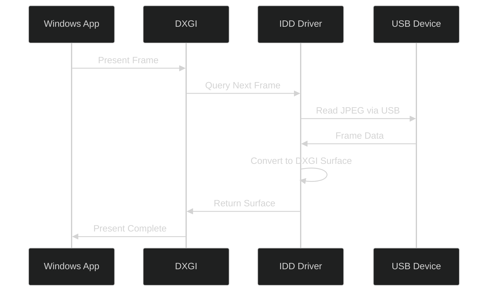
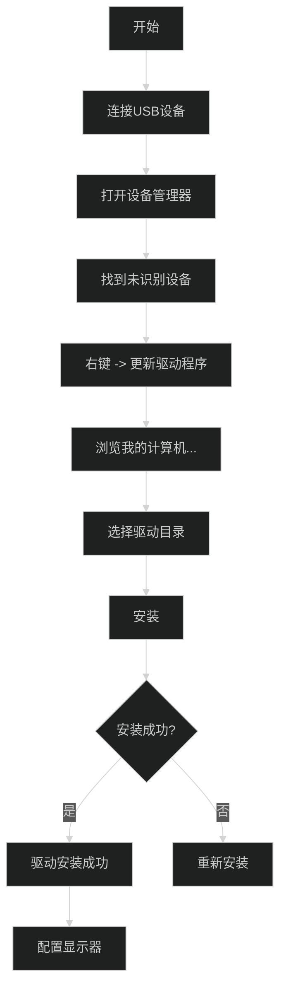
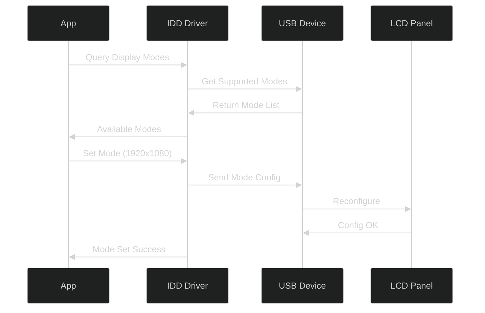
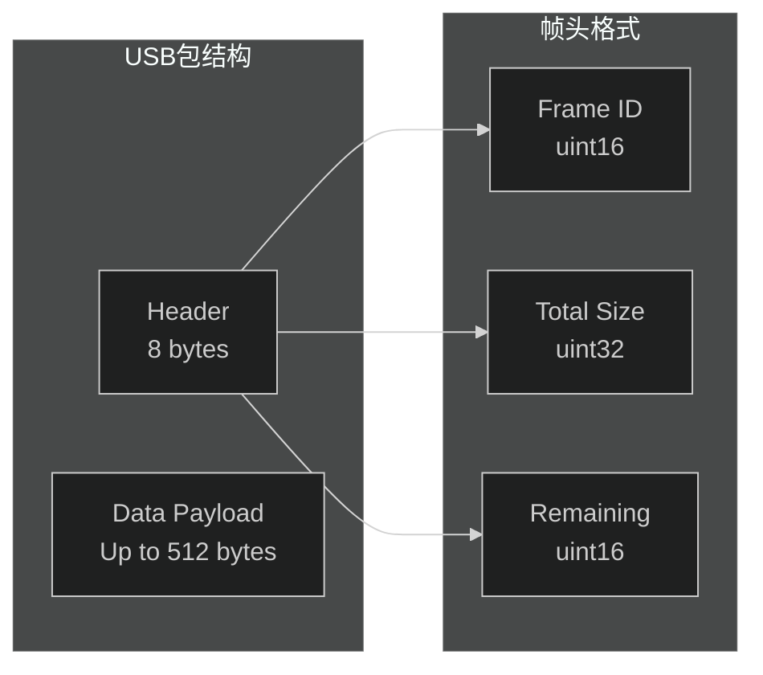

# Windows驱动专题

## 一、Windows IDD驱动概述

### 1.1 IDD驱动简介

<span style="color:red;">IDD (Indirect Display Driver) 是Windows提供的间接显示驱动程序模型，用于支持非传统GPU连接的显示器设备。</span>

### 1.2 IDD驱动特点

| 特点 | 说明 |
|:--|:--|
| 用户模式驱动 | 简化开发，无需内核开发 |
| 标准显示设备 | 系统视为普通显示器 |
| 即插即用 | 支持热插拔 |
| 硬件抽象 | 不需要GPU硬件 |

### 1.3 IDD vs 传统驱动

| 对比项 | IDD驱动 | 传统显示驱动 |
|:--|:--|:--|
| 开发难度 | 低 | 高 |
| 驱动模型 | 用户模式 | 内核模式 |
| 硬件依赖 | 无GPU | 需要GPU |
| 性能 | 受限 | 最佳 |
| 应用场景 | 虚拟显示 | 物理显示 |

---

## 二、IDD驱动架构

### 2.1 IDD驱动组件

```mermaid
%%{init: {'theme':'dark'}}%%
graph TB
    subgraph Windows_Display_Model["Windows显示模型"]
        subgraph UMDF["用户模式 (UMDF)"]
            IDD_DRV["IDD Driver<br/>(间接显示驱动)"]
            IDD_ADAPTER["IDDCX Adapter"]
            MONITOR["Monitor<br/>(虚拟)"]
        end

        subgraph KMDF["内核模式"]
            DXGI["DXGI Runtime"]
            DXGIDDISTUB["DXGIDDISTUB"]
        end

        subgraph GPU["GPU Hardware"]
            GPU["GPU Hardware"]
        end
    end

    IDD_DRV --> IDD_ADAPTER
    IDD_ADAPTER --> DXGI
    DXGI --> DXGIDDISTUB
    DXGIDDISTUB --> GPU
    MONITOR --> IDD_ADAPTER

    style IDD_DRV fill:#4CAF50,stroke:#fff
    style IDD_ADAPTER fill:#2196F3,stroke:#fff
```

### 2.2 IDD驱动工作流程



---

## 三、驱动目录结构

### 3.1 驱动源码结构

```
windows_driver/
├── inf/                          # INF配置文件
│   ├── esp_udisp.inf             # 主INF文件
│   └── esp_udisp.cat             # 签名目录
├── src/                          # 驱动源码
│   ├── Adapter.cpp               # 适配器实现
│   ├── Monitor.cpp               # 监视器实现
│   ├── FrameBuffer.cpp           # 帧缓冲管理
│   ├── UsbDevice.cpp             # USB通信
│   ├── JpegEncoder.cpp           # JPEG编码 (可选)
│   └── Utils.cpp                 # 工具函数
├── inc/                          # 头文件
│   ├── Adapter.h
│   ├── Monitor.h
│   └── Common.h
├── build/                        # 构建输出
└── README.md                     # 使用说明
```

### 3.2 INF配置文件

```inf
; esp_udisp.inf - ESP USB Display Driver

[Version]
Signature       = "$WINDOWS NT$"
Class           = "Monitor"
ClassGuid       = {4D36E96E-E325-11CE-BFC1-08002BE10318}
Provider        = %ProviderName%
DriverVer       = 04/02/2026,1.0.0.0
CatalogFile     = esp_udisp.cat

[Manufacturer]
%MfgName% = Espressif

[Espressif]
%DeviceDesc% = DeviceInstall, USB\VID_303A&PID_2986&MI_00

[DeviceInstall]
Include = monitor.inf
Needs = Monitor
CopyFiles = DriverCopyFiles
AddReg    = MonitorAddReg
```

---

## 四、VID/PID配置

### 4.1 设备识别

| 参数 | 值 | 说明 |
|:--|:--|:--|
| VID | 0x303A | Espressif |
| PID | 0x2986 | USB Display |
| MI (Interface) | 0x00 | 复合设备接口0 |

### 4.2 INF中的设备标识

```inf
[Strings]
ProviderName   = "Espressif"
MfgName        = "Espressif Systems"
DeviceDesc     = "ESP USB Display"

; 复合设备需要精确匹配接口
; USB\VID_303A&PID_2986&MI_00 表示接口0
```

⚠️ **重要**：复合设备的INF必须精确匹配到接口级别。

---

## 五、驱动安装流程

### 5.1 安装前准备

#### 5.1.1 启用测试签名

```powershell
# 以管理员身份运行命令提示符
bcdedit /set testsigning on
# 重启计算机
```

#### 5.1.2 禁用驱动签名强制

1. 设置 → Windows更新 → 恢复 → 高级启动
2. 疑难解答 → 高级选项 → 启动设置 → 重启
3. 选择"禁用驱动程序签名强制"

### 5.2 驱动安装步骤



### 5.3 安装验证

1. 打开设备管理器
2. 展开"显示适配器"
3. 应该看到 "ESP USB Display"
4. 打开"监视器"类别，应该看到虚拟显示器

---

## 六、分辨率配置

### 6.1 支持的分辨率

| 分辨率 | 刷新率 | 说明 |
|:--|:--|:--|
| 800×480 | 60Hz | 基础分辨率 |
| 1024×600 | 60Hz | ⚠️ 默认使用 |
| 1280×720 | 60Hz | HD |
| 1920×1080 | 60Hz | Full HD (需要高压缩) |

### 6.2 描述符字符串格式

```c
// USB描述符中的分辨率字符串
// 格式: "R<width>x<height>"

char resolution_string[] = "R1024x600";

// 支持EDID查询动态切换
typedef struct {
    uint16_t width;
    uint16_t height;
    uint8_t  refresh;     // Hz
} display_mode_t;
```

### 6.3 动态分辨率切换



---

## 七、JPEG压缩配置

### 7.1 压缩质量等级

| 等级 | 压缩比 | 带宽占用 | 适用场景 |
|:--|:--|:--|:--|
| 1 | ~50:1 | ~1.5 MB/s | 低带宽 |
| 4 | ~20:1 | ~3.7 MB/s | ⚠️ 默认 |
| 7 | ~10:1 | ~7.5 MB/s | 高质量 |
| 10 | ~5:1 | ~15 MB/s | 最佳质量 |

### 7.2 描述符字符串配置

```c
// 格式: "R<width>x<height>|Ejpg<quality>|..."

// 示例配置
char config_string[] = "R1024x600|Ejpg4|";

// 解析说明
// R1024x600 - 分辨率
// Ejpg4    - JPEG质量等级4
```

### 7.3 带宽计算

| 分辨率 | 质量 | 原始数据 | JPEG数据 | 压缩比 |
|:--|:--|:--|:--|:--|
| 1024×600 | Ejpg4 | 1.23 MB/帧 | ~60 KB/帧 | ~20:1 |
| 1920×1080 | Ejpg4 | 4.15 MB/帧 | ~200 KB/帧 | ~20:1 |

---

## 八、帧传输协议

### 8.1 USB Bulk传输协议



### 8.2 帧数据结构

```c
// 帧头定义
typedef struct __attribute__((packed)) {
    uint16_t frame_id;     // 帧序号
    uint32_t total_size;   // 完整帧大小
    uint16_t remaining;   // 剩余包数量
} frame_header_t;

// 帧尾包
typedef struct __attribute__((packed)) {
    frame_header_t header;
    uint8_t data[508];     // 512 - 4(header)
} frame_packet_t;
```

---

## 九、INF配置文件详解

### 9.1 完整INF示例

```inf
; ==========================================
; esp_udisp.inf - ESP USB Display Driver
; ==========================================

[Version]
Signature       = "$WINDOWS NT$"
Class           = "Monitor"
ClassGuid       = {4D36E96E-E325-11CE-BFC1-08002BE10318}
Provider        = %ProviderName%
DriverVer       = 04/02/2026,1.0.0.0
CatalogFile     = esp_udisp.cat
PnpLockdown     = 1

[DestinationDirs]
DefaultDestDir = 12
DriverCopyFiles = 12

[SourceDisksNames]
1 = %DiskName%,,,""

[SourceDisksFiles]
esp_udisp.dll = 1
esp_udisp.inf = 1

[Manufacturer]
%MfgName% = Espressif,NTamd64

[Espressif]
%DeviceDesc% = DeviceInstall, USB\VID_303A&PID_2986&MI_00

[Espressif.NTamd64]
%DeviceDesc% = DeviceInstall, USB\VID_303A&PID_2986&MI_00

[DeviceInstall]
Include = monitor.inf
Needs   = Monitor
CopyFiles = DriverCopyFiles
AddReg   = MonitorAddReg

[DriverCopyFiles]
esp_udisp.dll,,,0x00004000

[MonitorAddReg]
HKR,,EDID_INF,,"%DDInstall%"
HKR,,DriverDesc,,"%DeviceDesc%"

[DDInstall]
HKR,"Modes\1024x600",Mode,,"60-60,0-1024,0-600,0"
HKR,"EDID_Override","V02",0x01,00,ff,ff,ff,ff,ff,ff,00,3a,30,...

[Strings]
ProviderName   = "Espressif Systems"
MfgName        = "Espressif Systems"
DeviceDesc     = "ESP USB Display"
DiskName       = "ESP Display Driver Disk"
```

### 9.2 EDID数据

```c
// 1024x600@60Hz EDID数据 (部分)
static const uint8_t edid_1024x600[] = {
    // Header
    0x00, 0xFF, 0xFF, 0xFF, 0xFF, 0xFF, 0xFF, 0x00,
    // Vendor ID (Espressif: 303A)
    0x3A, 0x30, // Little-endian
    // Product ID
    0x86, 0x29,
    // Serial Number
    0x00, 0x00, 0x00, 0x00,
    // Week/Year
    0x00, 0x26,
    // Version 1.3
    0x01, 0x03,
    // Screen Size (10.2" x 5.7")
    0x80, 0x4A, 0x27, 0x78, 0x0A, 0xD5, 0xA5, 0x56,
    // Established Timings
    0x71, 0x4C, 0xB0, 0x23,
    // Standard Timing 1024x600@60
    0x59, 0xCA, 0x29, 0x50, 0x40, 0x45, 0x01, 0x01,
    0x01, 0x01,
    // Detailed Timing (1024x600 @ 60Hz)
    0x88, 0x1C, 0x16, 0xA0, 0x50, 0x00, 0x2A, 0x40,
    0x30, 0x20, 0x36, 0x00, 0x06, 0xC2, 0x10, 0x00,
    0x00, 0x1A,
    // Descriptor: Display Name
    0x00, 0x00, 0x00, 0xFC, 0x00, 'E','S','P',' ','D','i','s','p','l','a','y',0x0A,
    // Descriptor: Range Limits
    0x00, 0x00, 0x00, 0xFD, 0x00, 0x3C, 0x64, 0x0F,
    0x44, 0x0F, 0x00, 0x0A, 0x0A, 0x0A, 0x0A, 0x0A,
    // Checksum
    0x00
};
```

---

## 十、驱动调试

### 10.1 调试日志

```cpp
// 添加调试输出
#define DEBUG_TRACE(fmt, ...) \
    DbgPrint("[ESP_UDISP] " fmt "\n", __VA_ARGS__)

// 使用示例
DEBUG_TRACE("Frame %u received, size %u bytes", frame_id, size);
```

### 10.2 常见问题排查

| 问题 | 可能原因 | 解决方案 |
|:--|:--|:--|
| 设备不识别 | INF路径错误 | 检查目录 |
| 签名错误 | 未启用测试签名 | 执行测试签名命令 |
| 驱动安装失败 | VID/PID不匹配 | 确认描述符 |
| 显示黑屏 | 传输中断 | 检查USB连接 |
| 分辨率不对 | EDID错误 | 更新EDID数据 |

### 10.3 调试工具

```powershell
# 查看已安装的显示器
Get-PnpDevice -Class Monitor | Format-List

# 查看设备状态
devmgmt.msc

# 检查驱动签名
sigverif.exe
```

---

## 十一、驱动签名

### 11.1 签名要求

| Windows版本 | 签名要求 |
|:--|:--|
| Windows 10 1607+ | EV代码签名证书 |
| Windows 7/8 | 测试签名可用 |
| Windows 11 | 强制驱动签名 |

### 11.2 测试签名模式

```powershell
# 启用测试签名
bcdedit /set testsigning on

# 禁用测试签名
bcdedit /set testsigning off

# 查看当前状态
bcdedit /enum | findstr testsigning
```

---

## 十二、版本信息

| 版本 | 日期 | 修改内容 |
|:--|:--|:--|
| v1.0 | 2026-04-02 | 初始版本 |

---

## 十三、参考资料

| 参考资料 | 链接 |
|:--|:--|
| IDD驱动概述 | [Microsoft Docs](https://learn.microsoft.com/en-us/windows-hardware/drivers/display/indirect-display-driver-model-overview) |
| IDDCX参考 | [Microsoft Docs](https://learn.microsoft.com/en-us/windows-hardware/drivers/display/iddcx-objects-reference) |
| INF文件参考 | [Microsoft Docs](https://learn.microsoft.com/en-us/windows-hardware/drivers/install/inf-files) |
| 原始驱动源码 | [GitHub](https://github.com/chuanjinpang/win10_idd_xfz1986_usb_graphic_driver_display) |
