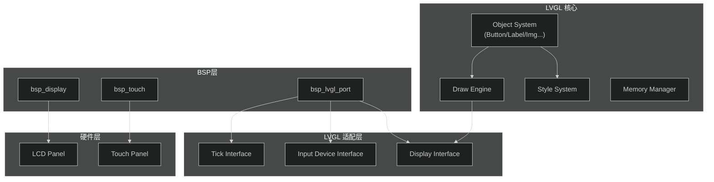
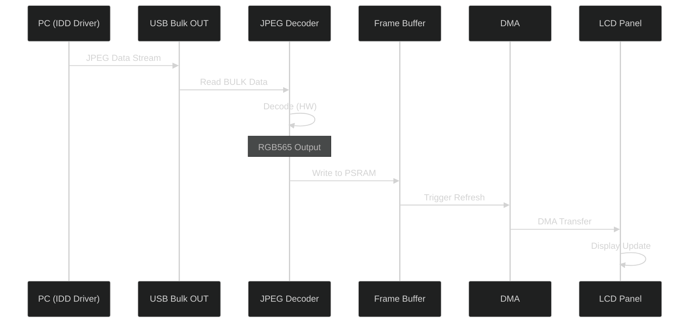

# 显示技术专题

## 一、显示系统概述

### 1.1 显示参数

| 参数 | 值 | 说明 |
|:--|:--|:--|
| 分辨率 | 1024×600 | 可配置 |
| 像素格式 | RGB565 | 16位颜色 |
| 刷新率 | 60 FPS | 目标帧率 |
| 颜色深度 | 16位 (65536色) | R5-G6-B5 |
| 每帧字节 | ~1.23 MB | 未压缩 |
| LCD控制器 | EK79007 | MIPI DSI接口 |
| 触控点数 | 最多5点 | 支持多点触控 |

### 1.2 显示子系统架构

```mermaid
%%{init: {'theme':'dark'}}%%
graph TB
    subgraph 数据源["数据源 (PC端)"]
        APP["Windows App"]
        GPU["GPU Memory"]
        DRV["IDD Driver"]
    end

    subgraph 传输["USB传输"]
        USB_EP["USB BULK OUT"]
        PACKET["Packet Stream"]
    end

    subgraph 处理["图像处理 (P4端)"]
        JPEG_DEC["JPEG Decoder HW"]
        RGB565["RGB565 Buffer"]
        DMA["DMA Controller"]
    end

    subgraph 显示["显示输出"]
        DSI_HOST["MIPI DSI Host"]
        LCD_PANEL["LCD Panel<br/>(EK79007)"]
    end

    APP --> GPU
    GPU --> DRV
    DRV -->|"JPEG Stream"| USB_EP
    USB_EP --> PACKET
    PACKET --> JPEG_DEC
    JPEG_DEC --> RGB565
    RGB565 --> DMA
    DMA --> DSI_HOST
    DSI_HOST --> LCD_PANEL

    style 数据源 fill:#1a3a1a,stroke:#4CAF50
    style 传输 fill:#2a2a1a,stroke:#FFC107
    style 处理 fill:#1a1a3a,stroke:#2196F3
    style 显示 fill:#1a2a2a,stroke:#00BCD4
```



---

## 二、MIPI DSI接口

### 2.1 MIPI DSI概述

MIPI DSI (Display Serial Interface) 是移动设备常用的显示接口标准。本项目使用ESP32-P4的MIPI DSI Host外设连接 EK79007 LCD控制器。

### 2.2 MIPI DSI通道配置

| 配置项 | 值 | 说明 |
|:--|:--|:--|
| 数据通道数 | 2 Lane | DSI Data Lane 0-1 |
| 传输模式 | Command Mode | 命令/视频模式 |
| 颜色格式 | RGB565 | 16位颜色 |
| 时钟通道 | 1 | DSI Clock Lane |
| 最大速率 | 1.5 Gbps/lane | High-Speed |

### 2.3 MIPI DSI信号定义

| 信号 | 方向 | 功能 |
|:--|:--|:--|
| DSI_CLKP | 双向 | 时钟正极 |
| DSI_CLKN | 双向 | 时钟负极 |
| DSI_DP0 | 双向 | 数据 Lane 0 正极 |
| DSI_DN0 | 双向 | 数据 Lane 0 负极 |
| DSI_DP1 | 双向 | 数据 Lane 1 正极 |
| DSI_DN1 | 双向 | 数据 Lane 1 负极 |

### 2.4 MIPI DSI传输模式

| 模式 | 方向 | 用途 | 本项目 |
|:--|:--|:--|:--|
| Escape Mode | 低速 | 命令传输 | ⚠️ 使用 |
| High-Speed | 高速 | 视频数据传输 | ⚠️ 使用 |
| Bus Turnaround | 双向 | 控制器通信 | - |

---

## 三、EK79007 LCD控制器

### 3.1 EK79007特性

| 特性 | 参数 |
|:--|:--|
| 接口 | MIPI DSI 2 Lane |
| 分辨率 | Up to 1920×1200 |
| 颜色深度 | 24-bit (16.7M) |
| 最大速率 | 1.5 Gbps/lane |
| 电源 | 1.8V / 3.3V |
| 封装 | COF |

### 3.2 EK79007初始化序列

```c
// EK79007初始化命令示例
static const ek79007_cmd_t ek79007_init_cmds[] = {
    // 电源控制
    {0xFF, 1, {0x79}},           // Page Select
    {0x03, 1, {0x4C}},           // Power Control 1
    {0x04, 1, {0x4C}},           // Power Control 2
    {0x05, 1, {0x4C}},           // Power Control 3

    // 显示模式
    {0x01, 1, {0x00}},           // Sleep Out
    {0x11, 0, {}},               // Sleep Out
    {0x29, 0, {}},               // Display On
    {0x2A, 4, {0x00, 0x00, 0x03, 0xBF}},  // Column Address
    {0x2B, 4, {0x00, 0x00, 0x02, 0x57}},   // Page Address
};
```

### 3.3 EK79007寄存器

| 寄存器 | 地址 | 功能 |
|:--|:--|:--|
| 0x01 | Soft Reset | 软件复位 |
| 0x11 | Sleep Out | 退出睡眠模式 |
| 0x28 | Display Off | 关闭显示 |
| 0x29 | Display On | 开启显示 |
| 0x2A | CASET | 列地址设置 |
| 0x2B | PASET | 页地址设置 |
| 0x2C | RAMWR | RAM写入 |
| 0x3A | COLMOD | 像素格式设置 |

---

## 四、LVGL图形库

### 4.1 LVGL版本与配置

| 配置项 | 值 | 说明 |
|:--|:--|:--|
| LVGL版本 | v9.x | 最新稳定版 |
| 颜色格式 | RGB565 | 显示适配 |
| 缓冲区模式 | 3×帧缓冲 | 轮转使用 |
| 渲染模式 | Software | CPU渲染 |
| DPI | 160 | 每英寸点数 |

### 4.2 LVGL架构



### 4.3 LVGL显示驱动接口

```c
// LVGL显示驱动回调
void lvgl_port_display_flush(lv_display_t * disp,
                              const lv_area_t * area,
                              uint8_t * color_p)
{
    // 刷新区域: (area->x1, area->y1) 到 (area->x2, area->y2)
    // 颜色数据: color_p 指向RGB565格式的颜色数组

    // 传输数据到LCD
    esp_lcd_panel_draw_bitmap(panel, area->x1, area->y1,
                              area->x2 + 1, area->y2 + 1,
                              color_p);

    // 通知LVGL刷新完成
    lv_disp_flush_ready(disp);
}
```

### 4.4 LVGL任务配置

```c
// LVGL任务配置
#define LVGL_TASK_PRIORITY   1
#define LVGL_TASK_STACK      4096
#define LVGL_TASK_CORE       tskNO_AFFINITY
#define LVGL_TIMER_PERIOD    5   // ms

// LVGL刷新周期计算
// 60 FPS -> 16.67ms per frame
// LVGL timer: 5ms -> 200Hz
// 实际LCD刷新: 60Hz
```

---

## 五、JPEG压缩与解码

### 5.1 JPEG压缩原理

<span style="color:red;">由于USB带宽限制，显示数据在PC端进行JPEG压缩，ESP32-P4接收压缩数据后进行硬件解码。</span>

### 5.2 JPEG参数配置

| 参数 | 值 | 说明 |
|:--|:--|:--|
| 压缩质量 | 1-10 | 通过描述符配置 (`Ejpg4`) |
| 质量等级4 | ~20:1压缩比 | 平衡质量与带宽 |
| 色彩空间 | YUV | JPEG标准 |
| 采样格式 | 4:2:2 | Y:Cb:Cr = 2:1:1 |
| 编码位置 | PC端 (IDD驱动) | - |
| 解码位置 | ESP32-P4 (硬件) | JPEG Codec |

### 5.3 JPEG解码数据流



### 5.4 JPEG Codec配置

| 配置项 | 值 | 说明 |
|:--|:--|:--|
| 解码分辨率 | 1024×600 | 帧尺寸 |
| 输入格式 | JPEG Baseline | 标准JPEG |
| 输出格式 | RGB565 | LCD兼容 |
| 色彩空间转换 | YCbCr→RGB | 硬件支持 |
| DMA支持 | 是 | 自动传输 |

---

## 六、帧缓冲管理

### 6.1 帧缓冲策略

```mermaid
%%{init: {'theme':'dark'}}%%
graph TB
    subgraph PSRAM["PSRAM (Frame Buffers)"]
        FB1["Frame Buffer 1<br/>1024×600×2B"]
        FB2["Frame Buffer 2<br/>1024×600×2B"]
        FB3["Frame Buffer 3<br/>1024×600×2B"]
    end

    subgraph DMA["DMA Transfer"]
        CURRENT["Current Display"]
        NEXT["Next Buffer"]
        SWAP["Triple Buffer Swap"]
    end

    subgraph LCD["LCD Controller"]
        DISPLAY["Display Content"]
    end

    FB1 --> SWAP
    FB2 --> SWAP
    FB3 --> SWAP
    SWAP --> CURRENT
    CURRENT --> DISPLAY

    style PSRAM fill:#1a1a3a,stroke:#2196F3
    style DMA fill:#2a2a1a,stroke:#FFC107
    style LCD fill:#1a2a2a,stroke:#00BCD4
```



### 6.2 缓冲区大小计算

| 参数 | 值 | 计算 |
|:--|:--|:--|
| 单帧大小 | 1,228,800 B | 1024 × 600 × 2 |
| 帧缓冲数 | 3 | Triple Buffer |
| 总缓冲大小 | 3,686,400 B | 1,228,800 × 3 |
| 帧缓冲地址 | PSRAM | MALLOC_CAP_SPIRAM |

### 6.3 缓冲区轮转机制

```c
// 帧缓冲轮转
static uint8_t* frame_buffers[3];
static uint8_t current_buffer = 0;

// 获取下一个写入缓冲
static uint8_t* get_next_buffer(void) {
    return frame_buffers[(current_buffer + 1) % 3];
}

// 交换显示缓冲
static void swap_buffers(void) {
    current_buffer = (current_buffer + 1) % 3;
    // 触发LCD刷新
}
```

---

## 七、显示配置参数

### 7.1 sdkconfig显示配置

| 配置项 | 值 | 说明 |
|:--|:--|:--|
| `CONFIG_LCD_PIXEL_FORMAT_RGB565` | y | 像素格式 |
| `CONFIG_EXAMPLE_LCD_BUF_COUNT` | 3 | 缓冲数量 |
| `CONFIG_EXAMPLE_ENABLE_PRINT_FPS_RATE_VALUE` | y | FPS打印 |

### 7.2 显示分辨率配置

```c
// usb_descriptor.c 中的分辨率字符串
// 格式: "R<width>x<height>"

static char string_desc_arr[] = {
    // ...
    'R', '1', '0', '2', '4', 'x', '6', '0', '0',  // 1024x600
    // ...
};

// 支持的分辨率 (示例)
#define RES_800X480    "R800x480"
#define RES_1024X600   "R1024x600"   // 当前使用
#define RES_1280X720   "R1280x720"
#define RES_1920X1080  "R1920x1080"  // 需要JPEG高压缩
```

---

## 八、显示时序

### 8.1 MIPI DSI Video Mode时序

| 参数 | 值 | 说明 |
|:--|:--|:--|
| HFP | 80 | 行前消隐 |
| HBP | 60 | 行后消隐 |
| HSW | 20 | 行同步脉冲 |
| HA | 1024 | 有效数据 |
| Total H | 1184 | 完整行周期 |
| VFP | 10 | 帧前消隐 |
| VBP | 23 | 帧后消隐 |
| VSW | 10 | 帧同步脉冲 |
| VA | 600 | 有效行数 |
| Total V | 643 | 完整帧周期 |

### 8.2 像素时钟计算

| 参数 | 值 | 计算 |
|:--|:--|:--|
| 像素时钟 | 51.84 MHz | 1184 × 643 × 60 |
| DSI时钟 | 259.2 MHz | 51.84 × 2 × 2.5 (DDR) |
| 每像素 | 2字节 | RGB565 |

---

## 九、显示性能优化

### 9.1 DMA传输优化

| 优化项 | 方法 | 效果 |
|:--|:--|:--|
| 突发长度 | MAX=16 | 减少传输次数 |
| PSRAM访问 | 200MHz | 高带宽 |
| 对齐 | 64字节 | DMA要求 |
| 预取 | 使能 | 减少等待 |

### 9.2 LVGL渲染优化

| 优化项 | 方法 | 效果 |
|:--|:--|:--|
| 脏区域 | 最小刷新 | 减少传输 |
| 绘制缓冲 | 部分缓冲 | 减少内存 |
| 对象复用 | 缓存对象 | 减少分配 |
| 样式缓存 | 预计算 | 加速渲染 |

### 9.3 FPS监控

```c
// FPS计算
#define FPS_PRINT_INTERVAL  1000  // ms

static uint32_t frame_count = 0;
static uint32_t last_time = 0;

void print_fps(void) {
    uint32_t now = esp_log_timestamp();
    if (now - last_time >= FPS_PRINT_INTERVAL) {
        uint32_t fps = frame_count * 1000 / (now - last_time);
        ESP_LOGI(TAG, "FPS: %u", fps);
        frame_count = 0;
        last_time = now;
    }
    frame_count++;
}
```

---

## 十、常见问题与解决

### 10.1 显示问题排查

| 问题 | 可能原因 | 解决方案 |
|:--|:--|:--|
| 花屏 | DSI时序错误 | 检查初始化序列 |
| 闪屏 | 刷新不同步 | 同步帧缓冲 |
| 延迟大 | JPEG压缩比低 | 调整Ejpg等级 |
| 撕裂 | 缓冲交换时机 | 等待VSYNC |
| 无显示 | LCD未初始化 | 检查GPIO连接 |

### 10.2 调试方法

```bash
# 启用显示调试
idf.py monitor | grep -i lcd

# 检查ESP-IDF日志级别
# File: sdkconfig
CONFIG_LOG_DEFAULT_LEVEL_DEBUG=y
```

---

## 十一、版本信息

| 版本 | 日期 | 修改内容 |
|:--|:--|:--|
| v1.0 | 2026-04-02 | 初始版本 |

---

## 十二、参考资料

| 参考资料 | 链接 |
|:--|:--|
| ESP32-P4 LCD | [docs.espressif.com](https://docs.espressif.com/projects/esp-dev-kits/) |
| LVGL文档 | [lvgl.io](https://lvgl.io/) |
| MIPI DSI规范 | [MIPI Alliance](https://www.mipi.org/) |
| EK79007数据手册 | 厂商提供 |
