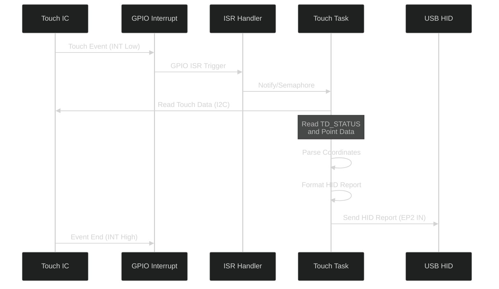
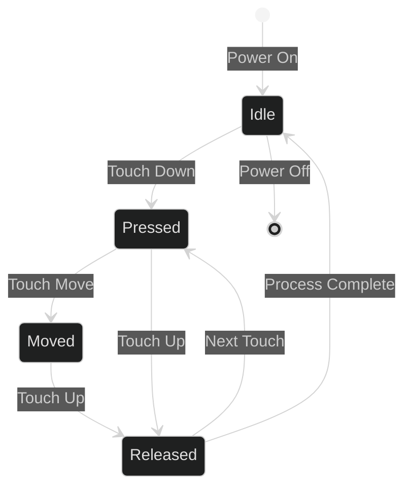

# 触控技术专题

## 一、触控系统概述

### 1.1 触控参数

| 参数 | 值 | 说明 |
|:--|:--|:--|
| 触控点数 | 最多5点 | 多点触控 |
| 触控分辨率 | 10-bit | 坐标精度 |
| 触控IC | FT5x06 / GT911 | 可选 |
| 通信接口 | I2C | 标准I2C |
| 中断方式 | GPIO中断 | 事件触发 |
| 报告速率 | 最高100Hz | 实时响应 |
| USB端点 | EP2 IN Interrupt | HID上报 |

### 1.2 触控系统架构

```mermaid
%%{init: {'theme':'dark'}}%%
graph TB
    subgraph Touch_Panel["触控面板"]
        ELECTRODE["ITO 电极阵列"]
        TP_IC["触控IC<br/>(FT5x06/GT911)"]
    end

    subgraph P4_Communication["P4通信"]
        I2C_BUS["I2C Bus"]
        GPIO_INT["GPIO Interrupt"]
    end

    subgraph Data_Processing["数据处理"]
        ISR["GPIO ISR"]
        TOUCH_TASK["Touch Task"]
        REPORT["HID Report"]
    end

    subgraph USB_HID["USB HID"]
        EP2_IN["EP2 IN Interrupt"]
        WIN_IN["Windows Input"]
    end

    ELECTRODE --> TP_IC
    TP_IC -->|"I2C"| I2C_BUS
    TP_IC -->|"INT Pin"| GPIO_INT
    GPIO_INT --> ISR
    ISR --> TOUCH_TASK
    TOUCH_TASK -->|"HID Report"| REPORT
    REPORT --> EP2_IN
    EP2_IN --> WIN_IN

    style Touch_Panel fill:#1a2a2a,stroke:#00BCD4
    style P4_Communication fill:#2a2a1a,stroke:#FFC107
    style Data_Processing fill:#1a1a3a,stroke:#2196F3
    style USB_HID fill:#1a3a1a,stroke:#4CAF50
```



---

## 二、触控IC对比

### 2.1 FT5x06与GT911对比

| 参数 | FT5x06 | GT911 | 说明 |
|:--|:--|:--|:--|
| 最大触控点 | 5点 | 5点 | 相同 |
| I2C地址 | 0x38 | 0x14/0x5D | 可配置 |
| 报告速率 | 100Hz | 100Hz | 相同 |
| 分辨率 | 10-bit | 10-bit | 相同 |
| 工作电压 | 2.8-3.3V | 2.8-3.3V | 相同 |
| 通信协议 | I2C | I2C | 相同 |
| 中断模式 | Polling/Interrupt | Interrupt | 相同 |
| 功耗 | 低 | 低 | 相同 |

### 2.2 触控IC选型

<span style="color:orange;">本项目支持两种触控IC (FT5x06 和 GT911)，通过 BSP 层抽象统一接口。</span>

---

## 三、触控IC寄存器

### 3.1 FT5x06寄存器

| 地址 | 名称 | 功能 | 访问 |
|:--|:--|:--|:--|
| 0x00 | TD_STATUS | 触控点状态 | R |
| 0x02-0x89 | TOUCH1-5 | 触控点1-5坐标 | R |
| 0xA4 | ID_G_MODE | 工作模式 | RW |
| 0xA5 | ID_G_TOUCH_TH | 触控阈值 | RW |
| 0xA6 | ID_G_TOUCH_PARA | 触控参数 | RW |
| 0x80-0x8F | Filter | 滤波参数 | RW |

### 3.2 FT5x06触控点数据结构

```c
// FT5x06 单点数据 (地址 0x02-0x08)
typedef struct __attribute__((packed)) {
    uint8_t hi_val;    // X坐标高4位 + 事件标志
    uint8_t x_low;     // X坐标低8位
    uint8_t y_low;     // Y坐标低8位
    uint8_t pressure;  // 压力值
} ft5x06_touch_point_t;

// 坐标计算
uint16_t x = ((uint16_t)(point->hi_val & 0x0F) << 8) | point->x_low;
uint16_t y = ((uint16_t)(point->hi_val >> 4) << 8) | point->y_low;
```

### 3.3 GT911寄存器

| 地址 | 名称 | 功能 | 访问 |
|:--|:--|:--|:--|
| 0x814E | TOUCH_POINT_NUM | 触控点数量 | R |
| 0x814F-0x8158 | POINTS | 5点坐标数据 | R |
| 0x8100 | ID_G_MODE | 工作模式 | RW |
| 0x8040 | THRESHOLD | 触控阈值 | RW |
| 0x8050 | REPORT_RATE | 报告速率 | RW |

### 3.4 GT911触控点数据结构

```c
// GT911 单点数据 (7字节)
typedef struct __attribute__((packed)) {
    uint8_t track_id;      // 触控点ID
    uint8_t x_low;         // X坐标低8位
    uint8_t x_high;        // X坐标高8位
    uint8_t y_low;         // Y坐标低8位
    uint8_t y_high;        // Y坐标高8位
    uint8_t size_low;      // 触控面积低8位
    uint8_t size_high;     // 触控面积高8位
} gt911_touch_point_t;

// 坐标计算
uint16_t x = ((uint16_t)point->x_high << 8) | point->x_low;
uint16_t y = ((uint16_t)point->y_high << 8) | point->y_low;
```

---

## 四、I2C通信配置

### 4.1 I2C参数配置

| 参数 | FT5x06 | GT911 |
|:--|:--|:--|
| I2C端口 | I2C_NUM_0 | I2C_NUM_0 |
| 时钟频率 | 400KHz | 400KHz |
| 从机地址 | 0x38 | 0x14/0x5D |
| SCL引脚 | BSP定义 | BSP定义 |
| SDA引脚 | BSP定义 | BSP定义 |

### 4.2 I2C初始化代码

```c
// I2C初始化配置
esp_err_t touch_i2c_init(void) {
    i2c_config_t conf = {
        .mode = I2C_MODE_MASTER,
        .sda_io_num = BSP_I2C_SDA,
        .scl_io_num = BSP_I2C_SCL,
        .sda_pullup_en = GPIO_PULLUP_ENABLE,
        .scl_pullup_en = GPIO_PULLUP_ENABLE,
        .master.clk_speed = 400000,  // 400KHz
    };
    ESP_ERROR_CHECK(i2c_param_config(I2C_NUM_0, &conf));
    ESP_ERROR_CHECK(i2c_driver_install(I2C_NUM_0, I2C_MODE_MASTER, 0, 0, 0));
    return ESP_OK;
}
```

---

## 五、触控数据处理

### 5.1 触控事件处理流程



### 5.2 触控状态机



---

## 六、HID报告格式

### 6.1 HID报告描述符

```c
// HID报告描述符 (触控)
static const uint8_t hid_report_desc[] = {
    0x05, 0x01,        // Usage Page (Generic Desktop)
    0x09, 0x02,        // Usage (Mouse)
    0xA1, 0x01,        // Collection (Application)
    0x09, 0x02,        // Usage (Mouse)
    0xA1, 0x02,        // Collection (Logical)
    // 触控点数据
    0x09, 0x01,        //   Usage (Pointer)
    0xA1, 0x00,        //   Collection (Physical)
    // X坐标
    0x09, 0x30,        //     Usage (X)
    0x09, 0x31,        //     Usage (Y)
    // 触控点数量
    0x09, 0x42,        //     Usage (Tip switch)
    0x15, 0x00,        //     Logical Minimum (0)
    0x25, 0x01,        //     Logical Maximum (1)
    0x75, 0x01,        //     Report Size (1)
    0x95, 0x02,        //     Report Count (2)
    0x81, 0x02,        //     Input (Data, Variable, Absolute)
    // 预留
    0x95, 0x06,        //     Report Count (6)
    0x81, 0x01,        //     Input (Constant)
    // 坐标数据 (10-bit)
    0x75, 0x10,        //     Report Size (16)
    0x95, 0x02,        //     Report Count (2)
    0x15, 0x00,        //     Logical Minimum (0)
    0x26, 0xFF, 0x03,  //     Logical Maximum (1023)
    0x09, 0x30,        //     Usage (X)
    0x09, 0x31,        //     Usage (Y)
    0x81, 0x02,        //     Input (Data, Variable, Absolute)
    0xC0,              //   End Collection
    0xC0,              // End Collection
};
```

### 6.2 HID报告数据格式

```c
// HID报告包结构 (8字节)
typedef struct __attribute__((packed)) {
    uint8_t buttons;       // 按钮状态 (bit0=主按键)
    uint8_t reserved[1];    // 预留 (6位)
    uint16_t x;            // X坐标 (0-1023)
    uint16_t y;            // Y坐标 (0-1023)
} hid_touch_report_t;

// 单点触控报告
// Byte 0: 0x01 (按钮按下)
// Byte 1: 0x00 (预留)
// Byte 2-3: X坐标低高字节
// Byte 4-5: Y坐标低高字节
// Byte 6-7: 预留
```

---

## 七、触控校准

### 7.1 坐标映射

| 参数 | 值 | 说明 |
|:--|:--|:--|
| 触控分辨率 | 0-1023 | 10-bit |
| 屏幕分辨率 | 0-1023 (X), 0-599 (Y) | 1024×600 |
| 映射方式 | 线性缩放 | - |

### 7.2 坐标转换公式

```c
// 原始坐标 -> 屏幕坐标
uint16_t screen_x = (touch_x * SCREEN_WIDTH) / TOUCH_MAX;
uint16_t screen_y = (touch_y * SCREEN_HEIGHT) / TOUCH_MAX;

// 或者使用校准矩阵
typedef struct {
    float scale_x;
    float scale_y;
    int16_t offset_x;
    int16_t offset_y;
} touch_calibration_t;

uint16_t screen_x = (touch_x * cal->scale_x) + cal->offset_x;
uint16_t screen_y = (touch_y * cal->scale_y) + cal->offset_y;
```

---

## 八、GPIO中断配置

### 8.1 中断引脚配置

| 参数 | 值 |
|:--|:--|
| GPIO编号 | BSP定义 |
| 中断类型 | GPIO_INTR_NEGEDGE |
| 上拉电阻 | 使能 |
| 去抖时间 | 约10ms (软件) |

### 8.2 中断处理代码

```c
// GPIO中断配置
gpio_config_t int_conf = {
    .pin_bit_mask = BIT64(TOUCH_INT_GPIO),
    .mode = GPIO_MODE_INPUT,
    .pull_up_en = GPIO_PULLUP_ENABLE,
    .pull_down_en = GPIO_PULLDOWN_DISABLE,
    .intr_type = GPIO_INTR_NEGEDGE,  // 下降沿触发
};
gpio_config(&int_conf);

// 中断服务程序
static void IRAM_ATTR touch_isr_handler(void* arg) {
    BaseType_t xHigherPriorityTaskWoken = pdFALSE;
    // 通知任务处理
    vTaskNotifyGiveFromISR(touch_task_handle, &xHigherPriorityTaskWoken);
    if (xHigherPriorityTaskWoken) {
        portYIELD_FROM_ISR();
    }
}
```

---

## 九、多点触控处理

### 9.1 多点触控协议

```c
// 多点触控报告 (简化版，每点独立报告)
typedef struct {
    uint8_t report_id;     // 报告ID
    uint8_t touch_count;   // 触控点数
    uint8_t x_low;         // X坐标低8位
    uint8_t x_high;        // X坐标高8位
    uint8_t y_low;         // Y坐标低8位
    uint8_t y_high;        // Y坐标高8位
    uint8_t pressure;      // 压力值
    uint8_t track_id;      // 触控点ID (0-4)
} multi_touch_report_t;
```

### 9.2 触控点追踪

```c
// 触控点状态
typedef struct {
    bool    active;        // 是否激活
    uint8_t track_id;      // 触控点ID
    uint16_t x;           // 当前X坐标
    uint16_t y;           // 当前Y坐标
    uint16_t last_x;      // 上次X坐标
    uint16_t last_y;      // 上次Y坐标
} touch_point_state_t;

// 触控点数组 (最多5点)
static touch_point_state_t touch_points[5];

// 触控点追踪算法
void update_touch_points(uint8_t* raw_data, uint8_t count) {
    for (int i = 0; i < count; i++) {
        uint8_t id = raw_data[i].track_id;
        if (id < 5) {
            touch_points[id].active = true;
            touch_points[id].x = raw_data[i].x;
            touch_points[id].y = raw_data[i].y;
        }
    }
}
```

---

## 十、配置参数

### 10.1 sdkconfig触控配置

| 配置项 | 值 | 说明 |
|:--|:--|:--|
| `CONFIG_TOUCH_TASK_PRIORITY` | 5 | 触控任务优先级 |

### 10.2 触控IC配置

| 配置项 | FT5x06 | GT911 |
|:--|:--|:--|
| I2C地址 | 0x38 | 0x14 |
| 中断GPIO | BSP定义 | BSP定义 |
| 复位GPIO | BSP定义 | BSP定义 |

---

## 十一、常见问题与解决

### 11.1 触控问题排查

| 问题 | 可能原因 | 解决方案 |
|:--|:--|:--|
| 触控无响应 | I2C地址错误 | 检查地址配置 |
| 坐标偏移 | 校准参数错误 | 执行校准 |
| 乱跳点 | 触控阈值过低 | 调整阈值 |
| 延迟大 | 中断优先级低 | 提高优先级 |
| 多点失效 | 触控IC不支持 | 确认型号 |

### 11.2 调试方法

```c
// 触控调试日志
ESP_LOGI(TAG, "Touch: point=%d, x=%d, y=%d, pressure=%d",
         touch_count, x, y, pressure);

// 检查I2C通信
esp_err_t err = i2c_master_write_read_device(
    I2C_NUM_0, addr, &reg, 1, data, len, 1000 / portTICK_PERIOD_MS);
if (err != ESP_OK) {
    ESP_LOGE(TAG, "I2C error: %d", err);
}
```

---

## 十二、版本信息

| 版本 | 日期 | 修改内容 |
|:--|:--|:--|
| v1.0 | 2026-04-02 | 初始版本 |

---

## 十三、参考资料

| 参考资料 | 链接 |
|:--|:--|
| FT5x06数据手册 | FocalTech提供 |
| GT911数据手册 | Goodix提供 |
| ESP-IDF I2C | [docs.espressif.com](https://docs.espressif.com/projects/esp-idf/) |
| USB HID规范 | [usb.org](https://www.usb.org/hid) |
