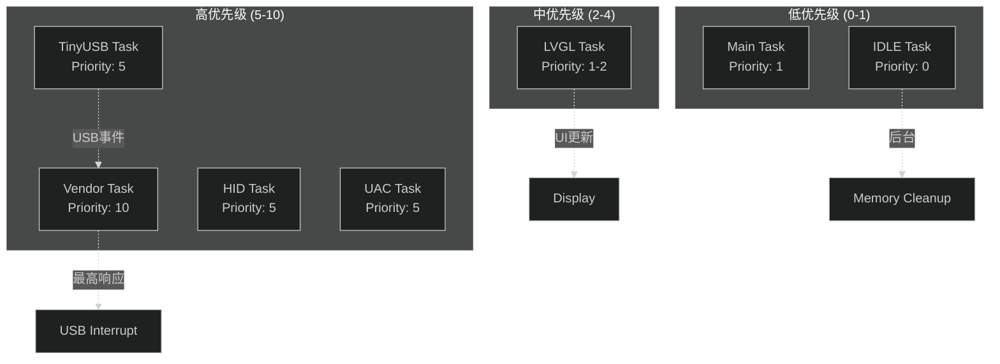
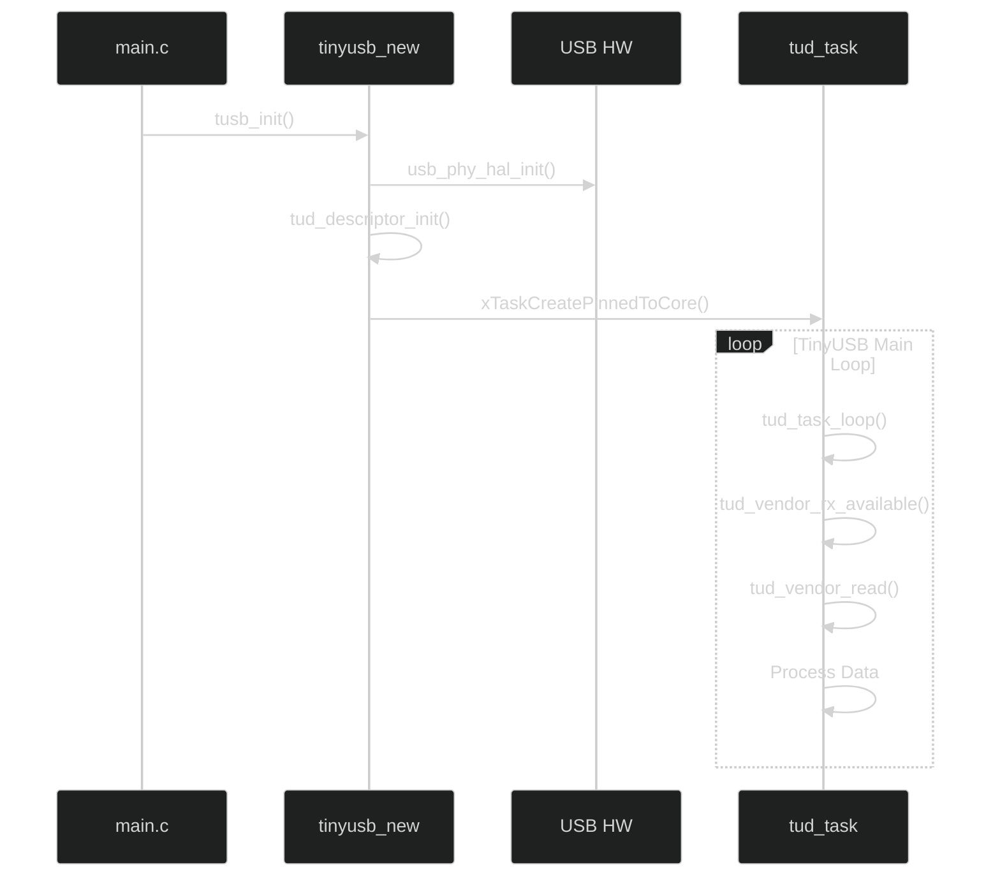
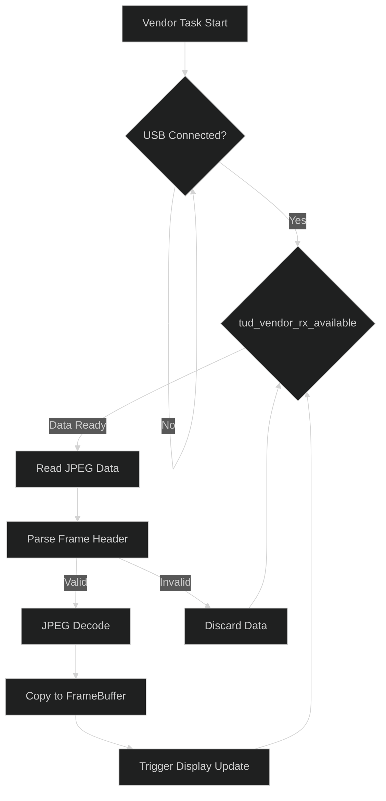
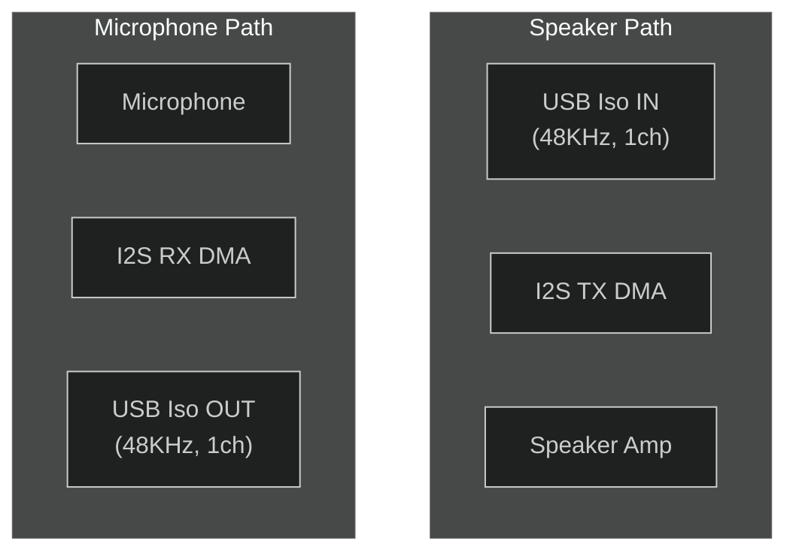
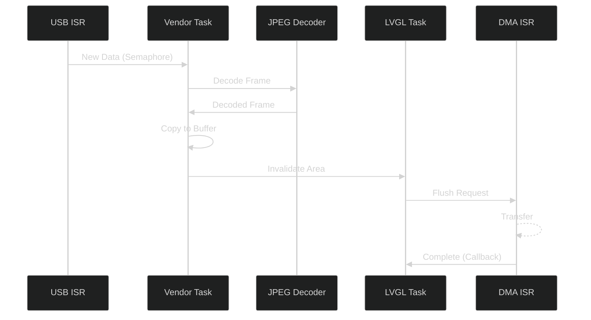

# FreeRTOS任务框架与多任务调度

## 一、FreeRTOS概述

### 1.1 ESP-IDF中的FreeRTOS

ESP32-P4 使用 ESP-IDF 5.4.0，内置 FreeRTOS 作为实时操作系统。ESP32-P4 是双核 RISC-V 架构，但本项目主要使用单核调度（`CONFIG_FREERTOS_UNICORE=y` 或 `CONFIG_FREERTOS_HZ=1000`）。

### 1.2 核心配置

| 配置项 | 值 | 说明 |
|:--|:--|:--|
| `CONFIG_FREERTOS_HZ` | 1000 | 系统时钟节拍 |
| `CONFIG_FREERTOS_UNICORE` | N | 双核运行（本项目可能启用） |
| `CONFIG_FREERTOS_TASK_FUNCTION_WRAPPER` | Y | 任务函数封装 |
| `CONFIG_FREERTOS_WATCHPOINT_END_OF_STACK` | Y | 栈监控 |

---

## 二、任务列表

### 2.1 系统任务总览

| 任务名 | 入口函数 | 优先级 | 栈大小 | 核心 | 创建方式 |
|:--|:--|:--:|:--:|:--:|:--|
| TinyUSB Task | `tud_task` | 5 | 4KB | -1 | `xTaskCreatePinnedToCore` |
| HID Task | `hidd_task` | 5 | 3KB | -1 | 内部创建 |
| UAC Task | `uac_task` | 5 | 4KB | -1 | `xTaskCreate` |
| Vendor Task | `vendor_task` | 10 | 4KB | -1 | `xTaskCreatePinnedToCore` |
| LVGL Task | `lvgl_task` | 1 | 8KB | -1 | `lvgl_port_start_timer` |
| Main Task | `app_main` | 1 | 8KB | APP_CPU | 内核创建 |

### 2.2 任务优先级映射



---

## 三、TinyUSB任务框架

### 3.1 TinyUSB架构

TinyUSB 是一个轻量级的USB协议栈，集成在ESP-IDF中。本项目使用 `leeebo__tinyusb_src` 组件。

### 3.2 任务初始化流程



### 3.3 任务间通信

| 通信方式 | 使用场景 |
|:--|:--|
| `Queue` | 帧数据传递 |
| `Semaphore` | USB传输完成信号 |
| `Event Group` | 连接状态标志 |

---

## 四、Vendor任务（显示数据）

### 4.1 任务配置

```c
// usb_device.c
#define VENDOR_TASK_PRIORITY    10
#define VENDOR_TASK_STACK_SIZE  4096
#define VENDOR_TASK_CORE        TSF_AFFINITY_NONE  // -1
```

### 4.2 任务循环



---

## 五、UAC音频任务

### 5.1 任务结构



### 5.2 任务配置

| 参数 | Speaker | Microphone |
|:--|:--|:--|
| 任务优先级 | 5 | 5 |
| 采样率 | 48000 Hz | 48000 Hz |
| 通道数 | 1 (Mono) | 1 (Mono) |
| 位深 | 16-bit | 16-bit |
| 传输间隔 | 10ms | 10ms |
| 每帧样本数 | 480 | 480 |

---

## 六、LVGL任务

### 6.1 LVGL集成架构


### 6.2 帧缓冲策略

| 缓冲模式 | 数量 | 总大小 | 说明 |
|:--|:--:|:--:|:--|
| 帧缓冲 | 3 | ~3.7MB | 轮转使用 |
| 显示缓冲 | 1 | ~1.2MB | 当前显示帧 |
| 绘制缓冲 | 1 | ~150KB | LVGL绘制区 |

---

## 七、任务间同步机制

### 7.1 同步原语使用

| 同步对象 | 类型 | 用途 |
|:--|:--|:--|
| `frame_ready_sem` | Semaphore | 帧数据就绪信号 |
| `usb_connected_evt` | Event Group | USB连接状态 |
| `display_queue` | Queue | 显示数据传递 |

### 7.2 同步时序图



---

## 八、内存管理

### 8.1 堆内存分配

| 区域 | 大小 | 用途 |
|:--|:--|:--|
| DRAM | 动态分配 | `heap_caps_malloc` |
| PSRAM | 帧缓冲 | `heap_caps_malloc(MALLOC_CAP_SPIRAM)` |
| DMA | 专用内存 | `MALLOC_CAP_DMA` |

### 8.2 内存池配置

```c
// 帧缓冲内存池 (PSRAM)
#define FRAME_BUFFER_SIZE   (1024 * 600 * 2)  // RGB565
#define FRAME_BUFFER_COUNT  3
#define FRAME_POOL_SIZE     (FRAME_BUFFER_SIZE * FRAME_BUFFER_COUNT)

// JPEG工作区
#define JPEG_WORK_SIZE      (1024 * 512)  // 512KB
```

---

## 九、电源管理

### 9.1 动态频率调整

| 组件 | 正常频率 | 降频阈值 | 说明 |
|:--|:--|:--|:--|
| CPU | 360 MHz | 240 MHz | 空闲时降频 |
| PSRAM | 200 MHz | 120 MHz | 低功耗模式 |
| APB | 120 MHz | 80 MHz | 总线频率 |

### 9.2 睡眠模式

| 模式 | 进入条件 | 唤醒源 |
|:--|:--|:--|
| Light Sleep | `esp_light_sleep_start()` | GPIO/定时器 |
| Deep Sleep | `esp_deep_sleep_start()` | RTC GPIO |

⚠️ **注意**：USB连接时不进入深度睡眠，避免断开连接。

---

## 十、调试与监控

### 10.1 任务状态监控

```bash
# 使用FreeRTOS任务列表
idf.py monitor
# 输入: tasks
```

### 10.2 栈使用监控

```c
// 检查任务栈使用
UBaseType_t free_stack = uxTaskGetStackHighWaterMark(NULL);
ESP_LOGI(TAG, "Free stack: %u bytes", free_stack * sizeof(StackType_t));
```

---

## 十一、版本信息

| 版本 | 日期 | 修改内容 |
|:--|:--|:--|
| v1.0 | 2026-04-02 | 初始版本 |

---

## 十二、参考资料

| 参考资料 | 链接 |
|:--|:--|
| FreeRTOS文档 | [link](https://www.freertos.org/a00106.html) |
| ESP-IDF任务管理 | [docs](https://docs.espressif.com/projects/esp-idf/en/latest/api-guides/freertos-smp/) |
