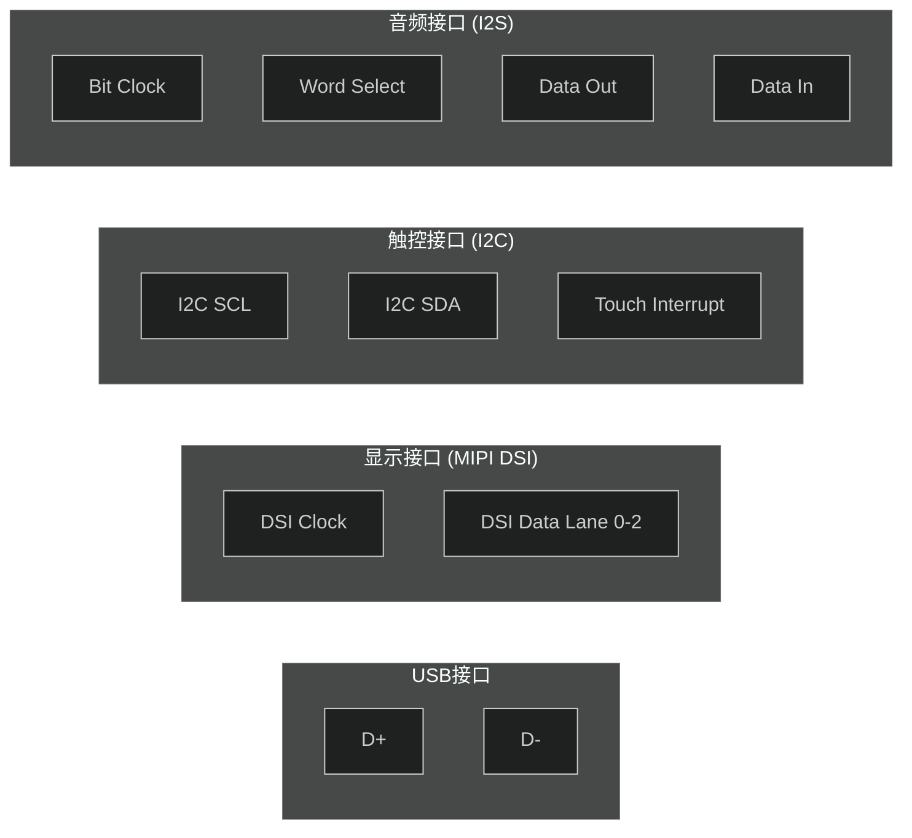
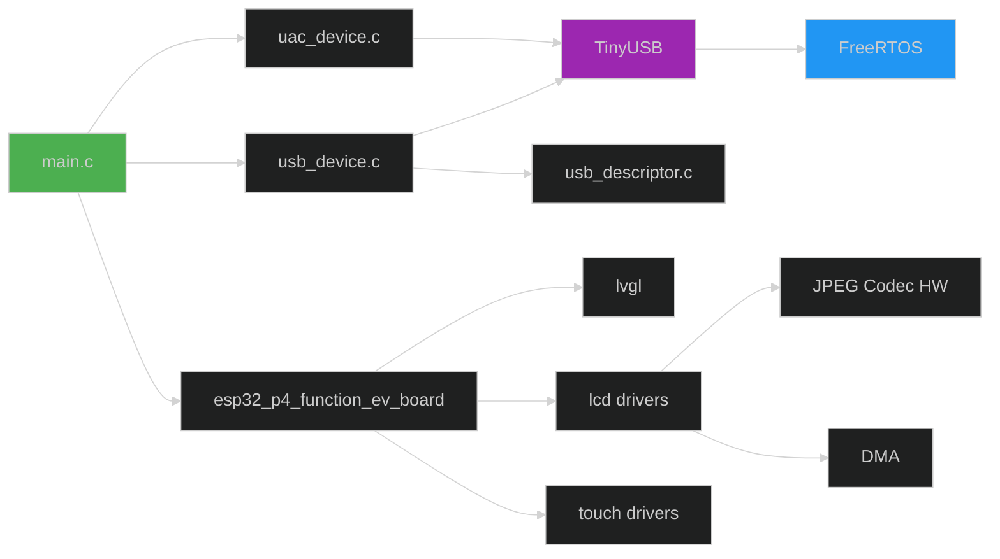
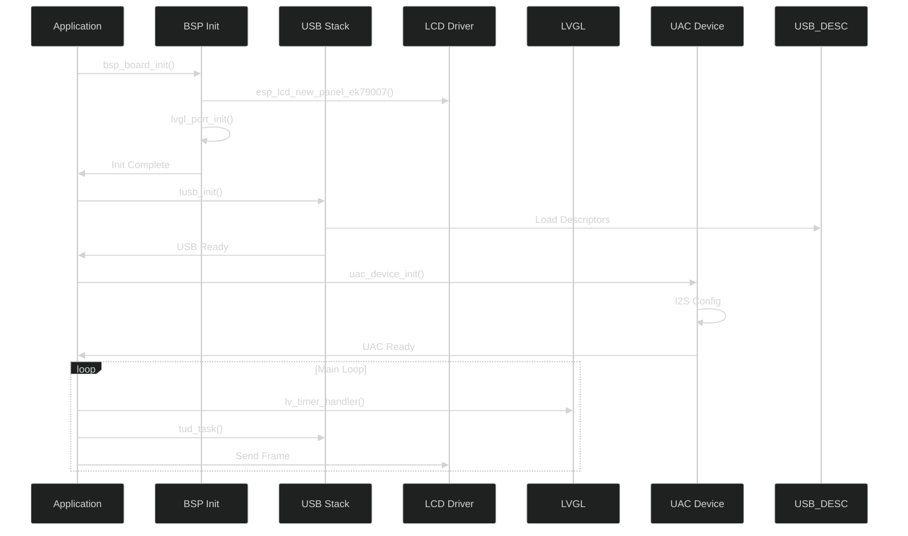

# ESP32-P4 USB扩展屏幕系统架构总览

## 一、系统概述

### 1.1 项目简介

ESP32-P4 USB扩展屏幕是一个让 ESP32-P4 开发板通过 USB 接口作为 Windows 操作系统外接显示器的项目。P4 设备模拟为一个复合 USB 设备，提供显示输出、音频输入/输出、触控输入等功能。

### 1.2 核心特性

| 特性 | 参数 | 备注 |
|:--|:--|:--|
| 屏幕分辨率 | 1024×600 | 可通过描述符字符串修改 |
| 刷新率 | 60 FPS | 目标帧率 |
| 触控点数 | 最多5点 | 支持多点触控 |
| 音频采样率 | 48000 Hz | UAC 标准采样率 |
| 音频通道 | 单声道 (1ch) | Speaker/Mic 各1通道 |
| USB模式 | High-Speed OTG | 高速 USB 2.0 |

### 1.3 系统架构图

```mermaid
%%{init: {'theme':'dark'}}%%
graph TB
    subgraph PC端["PC端 (Windows)"]
        WIN["Windows 操作系统"]
        IDD["IDD驱动<br/>(Indirect Display Driver)"]
        UD["USB Device Driver"]
    end

    subgraph P4端["ESP32-P4 设备端"]
        USB_OTG["USB OTG High-Speed"]
        TUSB["TinyUSB Stack"]
        HID["HID Interface<br/>(触控)"]
        VENDOR["Vendor Interface<br/>(显示数据)"]
        UAC["UAC Interface<br/>(音频)"]
        APP["Application Layer"]
        
        subgraph 显示模块["显示模块"]
            LCD["LCD Driver<br/>(EK79007)"]
            LVGL["LVGL Graphics"]
            JPEG["JPEG Encoder"]
        end
        
        subgraph 音频模块["音频模块"]
            I2S["I2S Driver"]
            SPK["Speaker Output"]
            MIC["Mic Input"]
        end
        
        subgraph 触控模块["触控模块"]
            TOUCH["Touch Driver<br/>(FT5x06/GT911)"]
            TP_DATA["Touch Data"]
        end
    end

    WIN --> IDD
    IDD --> UD
    UD -->|"USB HS"| USB_OTG
    USB_OTG --> TUSB
    
    TUSB --> HID
    TUSB --> VENDOR
    TUSB --> UAC
    
    VENDOR --> APP
    HID --> TP_DATA
    APP --> LCD
    APP --> JPEG
    LCD --> LVGL
    UAC --> I2S
    I2S --> SPK
    I2S --> MIC
    TP_DATA --> TOUCH

    style PC端 fill:#1a3a1a,stroke:#4CAF50
    style P4端 fill:#1a1a3a,stroke:#2196F3
    style 显示模块 fill:#2a2a1a,stroke:#FFC107
    style 音频模块 fill:#2a1a2a,stroke:#9C27B0
    style 触控模块 fill:#1a2a2a,stroke:#00BCD4
```

---

## 二、硬件架构

### 2.1 ESP32-P4 Function EV Board

| 硬件资源 | 配置 | 说明 |
|:--|:--|:--|
| 芯片型号 | ESP32-P4FN4 | RISC-V 架构 |
| CPU频率 | 360 MHz | 性能优化模式 |
| Flash | 16MB | 代码存储 |
| PSRAM | 200MHz HEX模式 | 帧缓冲/图像处理 |
| USB | HS OTG | USB 2.0 High Speed |

### 2.2 外设接口

### 2.3 关键硬件配置

| 配置项 | 值 | 位置 |
|:--|:--|:--|
| LCD控制器 | EK79007 | `sdkconfig` |
| LCD分辨率 | 1024×600 | `usb_descriptor.c` |
| 像素格式 | RGB565 | `CONFIG_LCD_PIXEL_FORMAT_RGB565` |
| 颜色深度 | 16位 | - |
| 帧缓冲数量 | 3 | `CONFIG_EXAMPLE_LCD_BUF_COUNT=3` |

---

## 三、软件架构

### 3.1 整体软件栈

```mermaid
%%{init: {'theme':'dark'}}%%
graph TB
    subgraph 应用层["应用层 (Application)"]
        APP_MAIN["main.c<br/>应用入口"]
        USB_DEV["usb_device.c<br/>USB设备管理"]
        UAC_DEV["uac_device.c<br/>UAC音频设备"]
    end

    subgraph 组件层["BSP/驱动层"]
        BSP["esp32_p4_function_ev_board<br/>BSP支持包"]
        LCD_EK79007["esp_lcd_ek79007<br/>EK79007驱动"]
        LCD_JD9165["esp_lcd_jd9165<br/>JD9165驱动"]
        TOUCH_FT5X06["esp_lcd_touch_ft5x06<br/>FT5x06触控"]
        TOUCH_GT911["esp_lcd_touch_gt911<br/>GT911触控"]
        LVGL["lvgl v9.x<br/>图形库"]
    end

    subgraph USB栈["USB协议栈"]
        TINYUSB["TinyUSB Stack<br/>(leeebo__tinyusb_src)"]
        USB_DESC["usb_descriptor.c<br/>描述符定义"]
    end

    subgraph IDF层["ESP-IDF框架"]
        FREERTOS["FreeRTOS<br/>实时操作系统"]
        DMA["DMA/GDMA<br/>直接内存访问"]
        JPEG_CODEC["JPEG Codec HW<br/>硬件JPEG编解码"]
        I2S["I2S Driver<br/>音频接口"]
        GPIO["GPIO/Matrix<br/>IO管理"]
    end

    APP_MAIN --> USB_DEV
    APP_MAIN --> UAC_DEV
    USB_DEV --> TINYUSB
    UAC_DEV --> TINYUSB
    TINYUSB --> USB_DESC
    BSP --> LCD_EK79007
    BSP --> LVGL
    TINYUSB --> FREERTOS
    LCD_EK79007 --> DMA
    JPEG_CODEC --> DMA
    I2S --> DMA

    style 应用层 fill:#1a3a1a,stroke:#4CAF50
    style 组件层 fill:#2a2a1a,stroke:#FFC107
    style USB栈 fill:#2a1a2a,stroke:#9C27B0
    style IDF层 fill:#1a1a3a,stroke:#2196F3
```

### 3.2 目录结构

| 目录 | 文件 | 功能 |
|:--|:--|:--|
| `main/` | `main.c` | 应用入口 |
| `main/usb_device/` | `usb_device.c` | USB显示设备实现 |
| `main/usb_device/` | `usb_descriptor.c` | USB描述符定义 |
| `main/uac/` | `uac_device.c` | UAC音频设备实现 |
| `main/include/` | 头文件目录 | 公共接口定义 |
| `components/` | BSP组件 | 板级支持包 |
| `windows_driver/` | IDD驱动 | Windows侧驱动 |

### 3.3 组件依赖关系

---

## 四、接口定义

### 4.1 USB设备接口

| 接口序号 | 接口类型 | 功能 | 端点配置 |
|:--|:--|:--|:--|
| 0 | IAD (Interface Association) | 复合设备关联 | - |
| 1 | Vendor Specific | 显示数据传输 | BULK IN/OUT |
| 2 | HID (Touch) | 触控数据上报 | Interrupt IN |
| 3 | Audio (Speaker) | 音频输出 | Isochronous IN |
| 4 | Audio (Mic) | 音频输入 | Isochronous OUT |

### 4.2 USB描述符配置

| 配置项 | 值 | 说明 |
|:--|:--|:--|
| VID | 0x303A | Espressif 厂商ID |
| PID | 0x2986 | 产品ID |
| 设备类别 | 0xEF (IAD) | 复合设备 |
| 配置值 | 1 | 默认配置 |
| MaxPower | 500mA | 最大电流消耗 |

---

## 五、系统启动流程

### 5.1 启动序列图

### 5.2 任务优先级

| 任务 | 优先级 | 核心 | 说明 |
|:--|:--:|:--:|:--|
| USB Task | 5 | -1 | TinyUSB主任务 |
| HID Task | 5 | -1 | 触控数据处理 |
| UAC Task | 5 | -1 | 音频数据传输 |
| Vendor Task | 10 | -1 | 显示数据传输 |
| LVGL Task | 1 | -1 | 图形渲染 |

---

## 六、数据流总览

### 6.1 显示数据流

```mermaid
%%{init: {'theme':'dark'}}%%
graph TB
    subgraph PC端
        APP_WIN["Windows App"]
        GPU["GPU Memory"]
        IDD_DRIVER["IDD Driver"]
    end

    subgraph P4端
        USB_EP["USB Bulk OUT"]
        JPEG_ENC["JPEG Encoder HW"]
        FRAMEBUF["Frame Buffer"]
        DMA["DMA Controller"]
        DSI["MIPI DSI Host"]
        LCD_PANEL["LCD Panel<br/>(EK79007)"]
    end

    APP_WIN --> GPU
    GPU --> IDD_DRIVER
    IDD_DRIVER -->|"JPEG Stream"| USB_EP
    USB_EP --> JPEG_ENC
    JPEG_ENC -->|"RGB565"| FRAMEBUF
    FRAMEBUF -->|"Memory Copy"| DMA
    DMA --> DSI
    DSI --> LCD_PANEL

    style PC端 fill:#1a3a1a,stroke:#4CAF50
    style P4端 fill:#1a1a3a,stroke:#2196F3
```

### 6.2 音频数据流

```mermaid
%%{init: {'theme':'dark'}}%%
graph LR
    subgraph PC端
        AUDIO_WIN["Windows Audio"]
        USB_IN["USB Isochronous IN"]
        USB_OUT["USB Isochronous OUT"]
    end

    subgraph P4端
        I2S_TX["I2S TX"]
        I2S_RX["I2S RX"]
        AMP["Speaker Amp"]
        MIC_IN["Microphone"]
    end

    AUDIO_WIN -->|"Speaker Data"| USB_IN
    USB_IN --> I2S_TX
    I2S_TX --> AMP
    
    MIC_IN --> I2S_RX
    I2S_RX -->|"Mic Data"| USB_OUT
    USB_OUT --> AUDIO_WIN

    style PC端 fill:#1a3a1a,stroke:#4CAF50
    style P4端 fill:#2a1a2a,stroke:#9C27B0
```

### 6.3 触控数据流

```mermaid
%%{init: {'theme':'dark'}}%%
graph LR
    subgraph 触控面板
        TOUCH_PANEL["Touch Panel"]
        TP_IC["触控IC<br/>(FT5x06/GT911)"]
    end

    subgraph P4端
        I2C_BUS["I2C Bus"]
        TOUCH_ISR["Touch ISR"]
        USB_INT["USB Interrupt IN"]
    end

    subgraph PC端
        WIN_IN["Windows Input"]
    end

    TOUCH_PANEL --> TP_IC
    TP_IC -->|"I2C"| I2C_BUS
    I2C_BUS --> TOUCH_ISR
    TOUCH_ISR -->|"HID Report"| USB_INT
    USB_INT --> WIN_IN

    style 触控面板 fill:#1a2a2a,stroke:#00BCD4
    style P4端 fill:#2a2a1a,stroke:#FFC107
    style PC端 fill:#1a3a1a,stroke:#4CAF50
```

---

## 七、关键技术参数

### 7.1 帧率与带宽计算

| 参数 | 值 | 计算公式 |
|:--|:--|:--|
| 分辨率 | 1024×600 | - |
| 像素格式 | RGB565 (2Bpp) | - |
| 每帧原始大小 | 1024×600×2 = 1.228 MB | - |
| 目标帧率 | 60 FPS | - |
| 原始带宽需求 | 73.7 MB/s | 1.228×60 |
| USB HS 理论带宽 | 60 MB/s | 480Mbps/8 |
| JPEG压缩比 | ~20:1 | `Ejpg4` 配置 |
| 压缩后带宽 | ~3.7 MB/s | 73.7/20 |

### 7.2 内存使用估算

| 内存区域 | 大小 | 用途 |
|:--|:--|:--|
| 帧缓冲 (×3) | ~3.7 MB | RGB565×1024×600×3 |
| JPEG工作区 | ~512 KB | 编码临时缓冲 |
| USB BULK缓冲 | ~64 KB | USB传输缓冲 |
| LVGL对象 | ~200 KB | UI元素内存 |

---

## 八、版本信息

| 版本 | 日期 | 修改内容 |
|:--|:--|:--|
| v1.0 | 2026-04-02 | 初始版本架构文档 |

---

## 九、参考资料

| 参考资料 | 链接 | 说明 |
|:--|:--|:--|
| ESP32-P4 Function EV Board | [文档](https://docs.espressif.com/projects/esp-dev-kits/en/latest/esp32p4/esp32-p4-function-ev-board/) | 官方BSP文档 |
| ESP-IDF v5.4 | [文档](https://docs.espressif.com/projects/esp-idf/en/latest/esp32p4/) | ESP-IDF参考 |
| TinyUSB | [文档](https://docs.tinyusb.org/) | USB协议栈文档 |
| Windows IDD | [MSDN](https://learn.microsoft.com/en-us/windows-hardware/drivers/display/indirect-display-driver-model-overview) | IDD驱动模型 |
