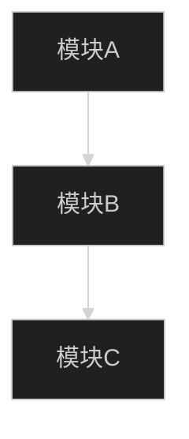
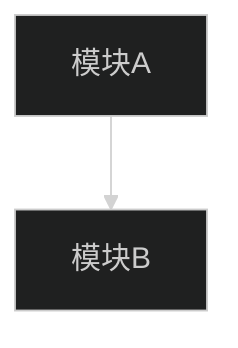

# ESP32-P4 USB扩展屏幕项目文档编写规范

## 一、文档编写原则

### 1.1 基本原则

| 原则 | 说明 |
|:--|:--|
| **准确性** | 所有技术参数必须与源代码/配置文件一致 |
| **完整性** | 包含足够的上下文和细节，避免断章取义 |
| **可追溯性** | 记录变更历史，标注参考来源 |
| **可维护性** | 使用模板和结构化格式，便于更新 |

### 1.2 文档层级

```
docs/
├── 官方文档/                    # 第三方官方技术文档 (只读，引用)
├── 项目开发文档/                # 项目开发文档 (可写)
│   ├── 文档编写规范.md          # 本文件 - 格式规范参考
│   ├── (项目框架) 文档名/       # 架构设计文档
│   ├── (专题开发) 文档名/       # 专题技术文档
│   ├── (调试记录) 文档名/       # 调试问题记录
│   └── (阶段报告) 文档名/       # 阶段报告
```

---

## 二、Markdown 格式规范

### 2.1 颜色标注

```markdown
<span style="color:red;">重点/核心结论/风险点</span>
<span style="color:green;">补充说明/文件路径</span>
<span style="color:orange;">注意事项/警告</span>
<span style="color:blue;">链接/参考</span>
```

⚠️ **红线规则**：`<span>` 标签内禁止包含 Markdown 语法

### 2.2 Mermaid 图表

```markdown

```

⚠️ **节点 ID**：禁止包含空格
⚠️ **文本换行**：使用 `<br>`，禁止 `\n`
⚠️ **列表编号**：数字与文字间**不可有空格**

### 2.3 状态标记

| 标记 | 含义 | 适用场景 |
|:--|:--|:--|
| ✅ | 已完成 | 需求/任务/功能 |
| ⬜ | 待完成 | 待办事项 |
| ⏳ | 进行中 | 正在开发的功能 |
| ❌ | 已废弃/失败 | 废弃的功能/失败的方案 |

### 2.4 代码块引用

```markdown
```c
// project/main/main.c#1:15
#include <stdio.h>
```
```

### 2.5 表格格式

```markdown
| 列1 | 列2 | 列3 |
|:--|:--|:--|
| 左对齐 | 居中 | 右对齐 |
```

---

## 三、文件命名规范

### 3.1 命名格式

| 类型 | 格式 | 示例 |
|:--|:--|:--|
| 架构文档 | `(项目框架) 名称.md` | `(项目框架) 系统架构.md` |
| 专题文档 | `(专题开发) 名称.md` | `(专题开发) USB协议.md` |
| 调试记录 | `(YYYY年MM月DD日) 问题.md` | `(20260402) USB枚举失败.md` |
| 阶段报告 | `(阶段报告) 名称.md` | `(阶段报告) v1.0验收.md` |
| 开发记录 | `(功能开发) 名称.md` | `(功能开发) 显示驱动.md` |

### 3.2 目录命名

| 类型 | 格式 | 示例 |
|:--|:--|:--|
| 任务文件夹 | `YYYY年MM月DD日：任务简述/` | `2026年04月02日：完善文档体系/` |
| 子目录 | `需求文档/`、`开发记录/`、`技术文档/`、`调试记录/` | - |

---

## 四、文档模板

### 4.1 架构文档模板

```markdown
# [架构主题]

## 一、架构概述
[一句话概括]

## 二、架构图


## 三、核心组件
### 3.1 组件A
| 属性 | 值 |
|:--|:--|
| 文件位置 | `path/to/file.c` |
| 核心API | `api_function()` |
| 依赖 | 依赖模块 |

### 3.2 组件B
[同上结构]

## 四、数据流
[数据流向描述]

## 五、控制流
[控制流程描述]

## 六、配置参数
| 参数 | 默认值 | 说明 |
|:--|:--|:--|
| PARAM_A | 100 | 参数说明 |

## 七、注意事项
- 注意点1
- 注意点2
```

### 4.2 专题文档模板

```markdown
# [技术专题]

## 一、基础知识
[核心概念]

## 二、技术原理
### 2.1 原理A
[详细说明]

### 2.2 原理B
[详细说明]

## 三、项目实现
### 3.1 代码路径
| 文件 | 功能 |
|:--|:--|
| `path/file.c` | 功能说明 |

### 3.2 核心代码
```c
// 代码片段
```

## 四、配置与调优
[配置项说明]

## 五、常见问题
| 问题 | 原因 | 解决方案 |
|:--|:--|:--|
| Q1 | 原因 | 方案 |

## 六、参考资料
- [官方文档链接]
```

### 4.3 调试记录模板

```markdown
# [问题描述]

## 一、问题现象
[现象描述，可包含截图]

## 二、环境信息
| 项目 | 值 |
|:--|:--|
| 芯片 | ESP32-P4 |
| IDF版本 | 5.4.0 |
| 问题时间 | YYYY-MM-DD |

## 三、排查过程
### 3.1 初步分析
[分析内容]

### 3.2 关键日志
```log
[日志内容]
```

### 3.3 定位步骤
1. 步骤1
2. 步骤2

## 四、根因分析
<span style="color:red;">[根本原因]</span>

## 五、解决方案
```c
// 修复代码
```

## 六、验证结果
[测试结果]

## 七、经验总结
[可复用的经验]
```

---

## 五、代码引用规范

### 5.1 单文件引用

```markdown
```startLine:endLine:filepath
// code content
```
```

### 5.2 多文件引用

```markdown
| 文件 | 功能 |
|:--|:--|
| `file1.c` | 功能1 |
| `file2.c` | 功能2 |
```

---

## 六、技术参数规范

### 6.1 参数来源优先级

1. **源代码定义** - 优先使用代码中的定义
2. **sdkconfig** - ESP-IDF 配置文件
3. **README.md** - 项目文档说明
4. **官方文档** - 第三方参考文档

### 6.2 参数标注格式

```markdown
| 参数名 | 值 | 来源 | 最后验证 |
|:--|:--|:--|:--|
| `CONFIG_XXX` | 100 | `sdkconfig#行号` | 2026-04-02 |
```

---

## 七、版本管理

### 7.1 文档版本格式

```markdown
| 版本 | 日期 | 修改内容 | 作者 |
|:--|:--|:--|:--|
| v1.0 | 2026-04-02 | 初始版本 | - |
```

### 7.2 变更记录要求

- 每次重大修改更新版本号
- 记录修改原因和影响范围
- 标注修改人和日期

---

## 八、参考资料链接规范

### 8.1 链接格式

```markdown
| 参考资料 | 链接 | 说明 |
|:--|:--|:--|
| ESP-IDF 文档 | [链接](URL) | 官方文档 |
| USB协议规范 | [链接](URL) | USB-IF官方 |
```

### 8.2 引用标注

在文档中引用外部资料时，使用上标标注：

```markdown
<span style="color:blue;">[1]</span>

[1]: 参考资料链接
```
